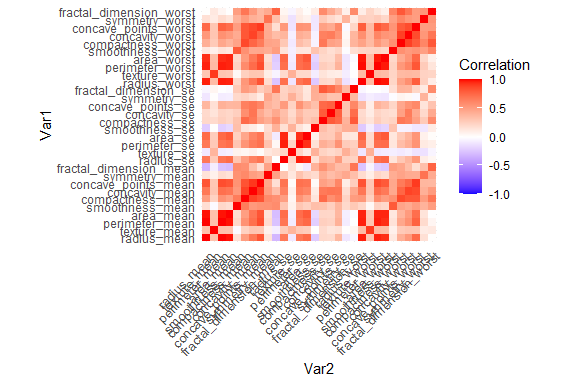
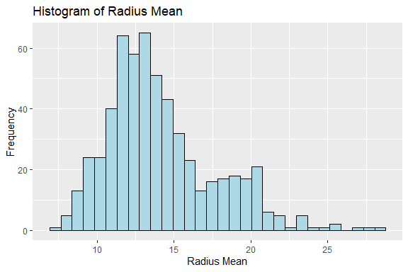
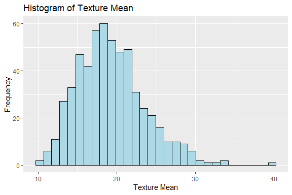
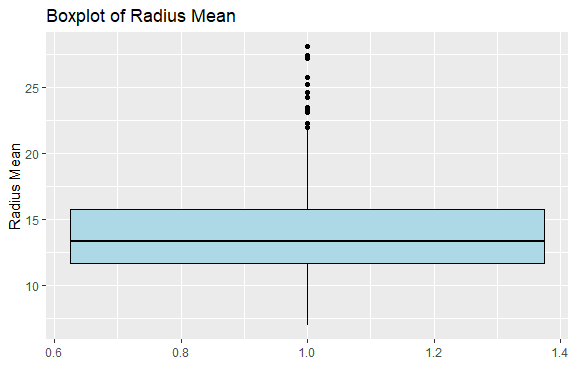
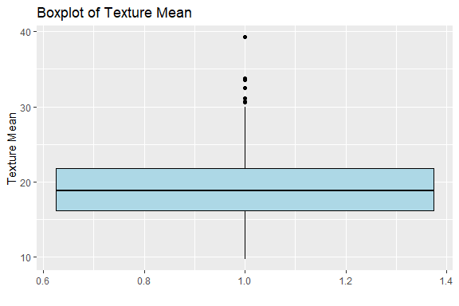
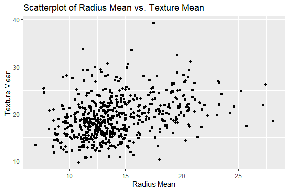

Breast Cancer Classification
================
Trevor Okinda
2024

- [Student Details](#student-details)
- [Setup Chunk](#setup-chunk)
- [Understanding the Dataset (Exploratory Data Analysis
  (EDA))](#understanding-the-dataset-exploratory-data-analysis-eda)
  - [Loading the Dataset](#loading-the-dataset)
    - [Source:](#source)
    - [Reference:](#reference)
- [Exploratory Data Analysis](#exploratory-data-analysis)
  - [Load dataset](#load-dataset)
  - [Measures of frequency](#measures-of-frequency)
  - [Measures of Central Tendency](#measures-of-central-tendency)
  - [Measures of Distribution](#measures-of-distribution)
  - [Measures of relationship](#measures-of-relationship)
  - [Plots](#plots)
- [Preprocessing and Data
  Transformation](#preprocessing-and-data-transformation)
  - [Missing Values](#missing-values)
  - [Data normalization](#data-normalization)
- [Training Model](#training-model)
  - [Data Splitting](#data-splitting)
  - [Bootstrapping](#bootstrapping)
  - [Cross-validation](#cross-validation)
  - [Train different models](#train-different-models)
  - [Perfomance Comparison](#perfomance-comparison)
  - [Saving Model](#saving-model)

# Student Details

|                       |                              |
|-----------------------|------------------------------|
| **Student ID Number** | 134780                       |
| **Student Name**      | Trevor Okinda                |
| **BBIT 4.2 Group**    | C                            |
| **Project Name**      | Breast Cancer Classification |

# Setup Chunk

**Note:** the following KnitR options have been set as the global
defaults: <BR>
`knitr::opts_chunk$set(echo = TRUE, warning = FALSE, eval = TRUE, collapse = FALSE, tidy = TRUE)`.

More KnitR options are documented here
<https://bookdown.org/yihui/rmarkdown-cookbook/chunk-options.html> and
here <https://yihui.org/knitr/options/>.

# Understanding the Dataset (Exploratory Data Analysis (EDA))

## Loading the Dataset

### Source:

The dataset that was used can be downloaded here:
*\<<a href="https://www.kaggle.com/datasets/yasserh/breast-cancer-dataset\"
class="uri">https://www.kaggle.com/datasets/yasserh/breast-cancer-dataset\</a>\>*

### Reference:

*\<*Breast Cancer Wisconsin (Diagnostic) Dataset \[Data set\]. (n.d.).
Kaggle.
<https://www.kaggle.com/datasets/yasserh/breast-cancer-dataset>\* \>  

Refer to the APA 7th edition manual for rules on how to cite datasets:
<https://apastyle.apa.org/style-grammar-guidelines/references/examples/data-set-references>\*

# Exploratory Data Analysis

## Load dataset

``` r
# Load the breast cancer dataset
breast_cancer_data <- read.csv("breast_cancer.csv", colClasses = c(
  id = "character",
  diagnosis = "factor",
  radius_mean = "numeric",
  texture_mean = "numeric",
  perimeter_mean = "numeric",
  area_mean = "numeric",
  smoothness_mean = "numeric",
  compactness_mean = "numeric",
  concavity_mean = "numeric",
  concave_points_mean = "numeric",
  symmetry_mean = "numeric",
  fractal_dimension_mean = "numeric",
  radius_se = "numeric",
  texture_se = "numeric",
  perimeter_se = "numeric",
  area_se = "numeric",
  smoothness_se = "numeric",
  compactness_se = "numeric",
  concavity_se = "numeric",
  concave_points_se = "numeric",
  symmetry_se = "numeric",
  fractal_dimension_se = "numeric",
  radius_worst = "numeric",
  texture_worst = "numeric",
  perimeter_worst = "numeric",
  area_worst = "numeric",
  smoothness_worst = "numeric",
  compactness_worst = "numeric",
  concavity_worst = "numeric",
  concave_points_worst = "numeric",
  symmetry_worst = "numeric",
  fractal_dimension_worst = "numeric"
), header = TRUE)

# Display the structure of the dataset
str(breast_cancer_data)
```

    ## 'data.frame':    569 obs. of  32 variables:
    ##  $ id                     : chr  "842302" "842517" "84300903" "84348301" ...
    ##  $ diagnosis              : Factor w/ 2 levels "B","M": 2 2 2 2 2 2 2 2 2 2 ...
    ##  $ radius_mean            : num  18 20.6 19.7 11.4 20.3 ...
    ##  $ texture_mean           : num  10.4 17.8 21.2 20.4 14.3 ...
    ##  $ perimeter_mean         : num  122.8 132.9 130 77.6 135.1 ...
    ##  $ area_mean              : num  1001 1326 1203 386 1297 ...
    ##  $ smoothness_mean        : num  0.1184 0.0847 0.1096 0.1425 0.1003 ...
    ##  $ compactness_mean       : num  0.2776 0.0786 0.1599 0.2839 0.1328 ...
    ##  $ concavity_mean         : num  0.3001 0.0869 0.1974 0.2414 0.198 ...
    ##  $ concave_points_mean    : num  0.1471 0.0702 0.1279 0.1052 0.1043 ...
    ##  $ symmetry_mean          : num  0.242 0.181 0.207 0.26 0.181 ...
    ##  $ fractal_dimension_mean : num  0.0787 0.0567 0.06 0.0974 0.0588 ...
    ##  $ radius_se              : num  1.095 0.543 0.746 0.496 0.757 ...
    ##  $ texture_se             : num  0.905 0.734 0.787 1.156 0.781 ...
    ##  $ perimeter_se           : num  8.59 3.4 4.58 3.44 5.44 ...
    ##  $ area_se                : num  153.4 74.1 94 27.2 94.4 ...
    ##  $ smoothness_se          : num  0.0064 0.00522 0.00615 0.00911 0.01149 ...
    ##  $ compactness_se         : num  0.049 0.0131 0.0401 0.0746 0.0246 ...
    ##  $ concavity_se           : num  0.0537 0.0186 0.0383 0.0566 0.0569 ...
    ##  $ concave_points_se      : num  0.0159 0.0134 0.0206 0.0187 0.0188 ...
    ##  $ symmetry_se            : num  0.03 0.0139 0.0225 0.0596 0.0176 ...
    ##  $ fractal_dimension_se   : num  0.00619 0.00353 0.00457 0.00921 0.00511 ...
    ##  $ radius_worst           : num  25.4 25 23.6 14.9 22.5 ...
    ##  $ texture_worst          : num  17.3 23.4 25.5 26.5 16.7 ...
    ##  $ perimeter_worst        : num  184.6 158.8 152.5 98.9 152.2 ...
    ##  $ area_worst             : num  2019 1956 1709 568 1575 ...
    ##  $ smoothness_worst       : num  0.162 0.124 0.144 0.21 0.137 ...
    ##  $ compactness_worst      : num  0.666 0.187 0.424 0.866 0.205 ...
    ##  $ concavity_worst        : num  0.712 0.242 0.45 0.687 0.4 ...
    ##  $ concave_points_worst   : num  0.265 0.186 0.243 0.258 0.163 ...
    ##  $ symmetry_worst         : num  0.46 0.275 0.361 0.664 0.236 ...
    ##  $ fractal_dimension_worst: num  0.1189 0.089 0.0876 0.173 0.0768 ...

``` r
# View the first few rows of the dataset
head(breast_cancer_data)
```

    ##         id diagnosis radius_mean texture_mean perimeter_mean area_mean
    ## 1   842302         M       17.99        10.38         122.80    1001.0
    ## 2   842517         M       20.57        17.77         132.90    1326.0
    ## 3 84300903         M       19.69        21.25         130.00    1203.0
    ## 4 84348301         M       11.42        20.38          77.58     386.1
    ## 5 84358402         M       20.29        14.34         135.10    1297.0
    ## 6   843786         M       12.45        15.70          82.57     477.1
    ##   smoothness_mean compactness_mean concavity_mean concave_points_mean
    ## 1         0.11840          0.27760         0.3001             0.14710
    ## 2         0.08474          0.07864         0.0869             0.07017
    ## 3         0.10960          0.15990         0.1974             0.12790
    ## 4         0.14250          0.28390         0.2414             0.10520
    ## 5         0.10030          0.13280         0.1980             0.10430
    ## 6         0.12780          0.17000         0.1578             0.08089
    ##   symmetry_mean fractal_dimension_mean radius_se texture_se perimeter_se
    ## 1        0.2419                0.07871    1.0950     0.9053        8.589
    ## 2        0.1812                0.05667    0.5435     0.7339        3.398
    ## 3        0.2069                0.05999    0.7456     0.7869        4.585
    ## 4        0.2597                0.09744    0.4956     1.1560        3.445
    ## 5        0.1809                0.05883    0.7572     0.7813        5.438
    ## 6        0.2087                0.07613    0.3345     0.8902        2.217
    ##   area_se smoothness_se compactness_se concavity_se concave_points_se
    ## 1  153.40      0.006399        0.04904      0.05373           0.01587
    ## 2   74.08      0.005225        0.01308      0.01860           0.01340
    ## 3   94.03      0.006150        0.04006      0.03832           0.02058
    ## 4   27.23      0.009110        0.07458      0.05661           0.01867
    ## 5   94.44      0.011490        0.02461      0.05688           0.01885
    ## 6   27.19      0.007510        0.03345      0.03672           0.01137
    ##   symmetry_se fractal_dimension_se radius_worst texture_worst perimeter_worst
    ## 1     0.03003             0.006193        25.38         17.33          184.60
    ## 2     0.01389             0.003532        24.99         23.41          158.80
    ## 3     0.02250             0.004571        23.57         25.53          152.50
    ## 4     0.05963             0.009208        14.91         26.50           98.87
    ## 5     0.01756             0.005115        22.54         16.67          152.20
    ## 6     0.02165             0.005082        15.47         23.75          103.40
    ##   area_worst smoothness_worst compactness_worst concavity_worst
    ## 1     2019.0           0.1622            0.6656          0.7119
    ## 2     1956.0           0.1238            0.1866          0.2416
    ## 3     1709.0           0.1444            0.4245          0.4504
    ## 4      567.7           0.2098            0.8663          0.6869
    ## 5     1575.0           0.1374            0.2050          0.4000
    ## 6      741.6           0.1791            0.5249          0.5355
    ##   concave_points_worst symmetry_worst fractal_dimension_worst
    ## 1               0.2654         0.4601                 0.11890
    ## 2               0.1860         0.2750                 0.08902
    ## 3               0.2430         0.3613                 0.08758
    ## 4               0.2575         0.6638                 0.17300
    ## 5               0.1625         0.2364                 0.07678
    ## 6               0.1741         0.3985                 0.12440

``` r
# Open the dataset in a viewer window
View(breast_cancer_data)
```

## Measures of frequency

``` r
# Summary statistics for numeric variables
summary(breast_cancer_data[, -c(1, 2)]) 
```

    ##   radius_mean      texture_mean   perimeter_mean     area_mean     
    ##  Min.   : 6.981   Min.   : 9.71   Min.   : 43.79   Min.   : 143.5  
    ##  1st Qu.:11.700   1st Qu.:16.17   1st Qu.: 75.17   1st Qu.: 420.3  
    ##  Median :13.370   Median :18.84   Median : 86.24   Median : 551.1  
    ##  Mean   :14.127   Mean   :19.29   Mean   : 91.97   Mean   : 654.9  
    ##  3rd Qu.:15.780   3rd Qu.:21.80   3rd Qu.:104.10   3rd Qu.: 782.7  
    ##  Max.   :28.110   Max.   :39.28   Max.   :188.50   Max.   :2501.0  
    ##  smoothness_mean   compactness_mean  concavity_mean    concave_points_mean
    ##  Min.   :0.05263   Min.   :0.01938   Min.   :0.00000   Min.   :0.00000    
    ##  1st Qu.:0.08637   1st Qu.:0.06492   1st Qu.:0.02956   1st Qu.:0.02031    
    ##  Median :0.09587   Median :0.09263   Median :0.06154   Median :0.03350    
    ##  Mean   :0.09636   Mean   :0.10434   Mean   :0.08880   Mean   :0.04892    
    ##  3rd Qu.:0.10530   3rd Qu.:0.13040   3rd Qu.:0.13070   3rd Qu.:0.07400    
    ##  Max.   :0.16340   Max.   :0.34540   Max.   :0.42680   Max.   :0.20120    
    ##  symmetry_mean    fractal_dimension_mean   radius_se        texture_se    
    ##  Min.   :0.1060   Min.   :0.04996        Min.   :0.1115   Min.   :0.3602  
    ##  1st Qu.:0.1619   1st Qu.:0.05770        1st Qu.:0.2324   1st Qu.:0.8339  
    ##  Median :0.1792   Median :0.06154        Median :0.3242   Median :1.1080  
    ##  Mean   :0.1812   Mean   :0.06280        Mean   :0.4052   Mean   :1.2169  
    ##  3rd Qu.:0.1957   3rd Qu.:0.06612        3rd Qu.:0.4789   3rd Qu.:1.4740  
    ##  Max.   :0.3040   Max.   :0.09744        Max.   :2.8730   Max.   :4.8850  
    ##   perimeter_se       area_se        smoothness_se      compactness_se    
    ##  Min.   : 0.757   Min.   :  6.802   Min.   :0.001713   Min.   :0.002252  
    ##  1st Qu.: 1.606   1st Qu.: 17.850   1st Qu.:0.005169   1st Qu.:0.013080  
    ##  Median : 2.287   Median : 24.530   Median :0.006380   Median :0.020450  
    ##  Mean   : 2.866   Mean   : 40.337   Mean   :0.007041   Mean   :0.025478  
    ##  3rd Qu.: 3.357   3rd Qu.: 45.190   3rd Qu.:0.008146   3rd Qu.:0.032450  
    ##  Max.   :21.980   Max.   :542.200   Max.   :0.031130   Max.   :0.135400  
    ##   concavity_se     concave_points_se   symmetry_se       fractal_dimension_se
    ##  Min.   :0.00000   Min.   :0.000000   Min.   :0.007882   Min.   :0.0008948   
    ##  1st Qu.:0.01509   1st Qu.:0.007638   1st Qu.:0.015160   1st Qu.:0.0022480   
    ##  Median :0.02589   Median :0.010930   Median :0.018730   Median :0.0031870   
    ##  Mean   :0.03189   Mean   :0.011796   Mean   :0.020542   Mean   :0.0037949   
    ##  3rd Qu.:0.04205   3rd Qu.:0.014710   3rd Qu.:0.023480   3rd Qu.:0.0045580   
    ##  Max.   :0.39600   Max.   :0.052790   Max.   :0.078950   Max.   :0.0298400   
    ##   radius_worst   texture_worst   perimeter_worst    area_worst    
    ##  Min.   : 7.93   Min.   :12.02   Min.   : 50.41   Min.   : 185.2  
    ##  1st Qu.:13.01   1st Qu.:21.08   1st Qu.: 84.11   1st Qu.: 515.3  
    ##  Median :14.97   Median :25.41   Median : 97.66   Median : 686.5  
    ##  Mean   :16.27   Mean   :25.68   Mean   :107.26   Mean   : 880.6  
    ##  3rd Qu.:18.79   3rd Qu.:29.72   3rd Qu.:125.40   3rd Qu.:1084.0  
    ##  Max.   :36.04   Max.   :49.54   Max.   :251.20   Max.   :4254.0  
    ##  smoothness_worst  compactness_worst concavity_worst  concave_points_worst
    ##  Min.   :0.07117   Min.   :0.02729   Min.   :0.0000   Min.   :0.00000     
    ##  1st Qu.:0.11660   1st Qu.:0.14720   1st Qu.:0.1145   1st Qu.:0.06493     
    ##  Median :0.13130   Median :0.21190   Median :0.2267   Median :0.09993     
    ##  Mean   :0.13237   Mean   :0.25427   Mean   :0.2722   Mean   :0.11461     
    ##  3rd Qu.:0.14600   3rd Qu.:0.33910   3rd Qu.:0.3829   3rd Qu.:0.16140     
    ##  Max.   :0.22260   Max.   :1.05800   Max.   :1.2520   Max.   :0.29100     
    ##  symmetry_worst   fractal_dimension_worst
    ##  Min.   :0.1565   Min.   :0.05504        
    ##  1st Qu.:0.2504   1st Qu.:0.07146        
    ##  Median :0.2822   Median :0.08004        
    ##  Mean   :0.2901   Mean   :0.08395        
    ##  3rd Qu.:0.3179   3rd Qu.:0.09208        
    ##  Max.   :0.6638   Max.   :0.20750

``` r
# Frequency table for the 'diagnosis' variable
table(breast_cancer_data$diagnosis)
```

    ## 
    ##   B   M 
    ## 357 212

## Measures of Central Tendency

``` r
# Calculate mean for numeric variables
means <- sapply(breast_cancer_data[, -c(1, 2)], mean)

# Calculate median for numeric variables
medians <- sapply(breast_cancer_data[, -c(1, 2)], median)

# Calculate mode for the 'diagnosis' variable
mode <- as.character(names(sort(table(breast_cancer_data$diagnosis), decreasing = TRUE)[1]))

# Combine results into a data frame
central_tendency <- data.frame(
  Variable = names(means),
  Mean = means,
  Median = medians
)

# Add mode for the 'diagnosis' variable
# Add an empty 'Mean' and 'Median' column to match 'central_tendency'
mode_df <- data.frame(
  Variable = "diagnosis",
  Mean = NA, 
  Median = NA 
)
central_tendency <- rbind(central_tendency, mode_df)

# Print central tendency measures
print(central_tendency)
```

    ##                                        Variable         Mean    Median
    ## radius_mean                         radius_mean 1.412729e+01 1.337e+01
    ## texture_mean                       texture_mean 1.928965e+01 1.884e+01
    ## perimeter_mean                   perimeter_mean 9.196903e+01 8.624e+01
    ## area_mean                             area_mean 6.548891e+02 5.511e+02
    ## smoothness_mean                 smoothness_mean 9.636028e-02 9.587e-02
    ## compactness_mean               compactness_mean 1.043410e-01 9.263e-02
    ## concavity_mean                   concavity_mean 8.879932e-02 6.154e-02
    ## concave_points_mean         concave_points_mean 4.891915e-02 3.350e-02
    ## symmetry_mean                     symmetry_mean 1.811619e-01 1.792e-01
    ## fractal_dimension_mean   fractal_dimension_mean 6.279761e-02 6.154e-02
    ## radius_se                             radius_se 4.051721e-01 3.242e-01
    ## texture_se                           texture_se 1.216853e+00 1.108e+00
    ## perimeter_se                       perimeter_se 2.866059e+00 2.287e+00
    ## area_se                                 area_se 4.033708e+01 2.453e+01
    ## smoothness_se                     smoothness_se 7.040979e-03 6.380e-03
    ## compactness_se                   compactness_se 2.547814e-02 2.045e-02
    ## concavity_se                       concavity_se 3.189372e-02 2.589e-02
    ## concave_points_se             concave_points_se 1.179614e-02 1.093e-02
    ## symmetry_se                         symmetry_se 2.054230e-02 1.873e-02
    ## fractal_dimension_se       fractal_dimension_se 3.794904e-03 3.187e-03
    ## radius_worst                       radius_worst 1.626919e+01 1.497e+01
    ## texture_worst                     texture_worst 2.567722e+01 2.541e+01
    ## perimeter_worst                 perimeter_worst 1.072612e+02 9.766e+01
    ## area_worst                           area_worst 8.805831e+02 6.865e+02
    ## smoothness_worst               smoothness_worst 1.323686e-01 1.313e-01
    ## compactness_worst             compactness_worst 2.542650e-01 2.119e-01
    ## concavity_worst                 concavity_worst 2.721885e-01 2.267e-01
    ## concave_points_worst       concave_points_worst 1.146062e-01 9.993e-02
    ## symmetry_worst                   symmetry_worst 2.900756e-01 2.822e-01
    ## fractal_dimension_worst fractal_dimension_worst 8.394582e-02 8.004e-02
    ## 1                                     diagnosis           NA        NA

## Measures of Distribution

``` r
# Compute measures of distribution for numeric variables
distribution_stats <- data.frame(
  Variable = character(),
  Variance = numeric(),
  Standard_Deviation = numeric(),
  Skewness = numeric(),
  Kurtosis = numeric(),
  stringsAsFactors = FALSE
)

# Loop through numeric variables
for (col in names(breast_cancer_data[, -c(1, 2)])) {
  var_value <- var(breast_cancer_data[, col])
  sd_value <- sd(breast_cancer_data[, col])
  skewness_value <- moments::skewness(breast_cancer_data[, col])
  kurtosis_value <- moments::kurtosis(breast_cancer_data[, col])
  
  distribution_stats <- rbind(distribution_stats, data.frame(
    Variable = col,
    Variance = var_value,
    Standard_Deviation = sd_value,
    Skewness = skewness_value,
    Kurtosis = kurtosis_value
  ))
}

# Print measures of distribution
print(distribution_stats)
```

    ##                   Variable     Variance Standard_Deviation  Skewness  Kurtosis
    ## 1              radius_mean 1.241892e+01       3.524049e+00 0.9398934  3.827584
    ## 2             texture_mean 1.849891e+01       4.301036e+00 0.6487336  3.741145
    ## 3           perimeter_mean 5.904405e+02       2.429898e+01 0.9880370  3.953165
    ## 4                area_mean 1.238436e+05       3.519141e+02 1.6413905  6.609761
    ## 5          smoothness_mean 1.977997e-04       1.406413e-02 0.4551199  3.837945
    ## 6         compactness_mean 2.789187e-03       5.281276e-02 1.1869833  4.625140
    ## 7           concavity_mean 6.355248e-03       7.971981e-02 1.3974832  4.970592
    ## 8      concave_points_mean 1.505661e-03       3.880284e-02 1.1680903  4.046680
    ## 9            symmetry_mean 7.515428e-04       2.741428e-02 0.7236947  4.266117
    ## 10  fractal_dimension_mean 4.984872e-05       7.060363e-03 1.3010474  5.969017
    ## 11               radius_se 7.690235e-02       2.773127e-01 3.0804640 20.521162
    ## 12              texture_se 3.043159e-01       5.516484e-01 1.6421003  8.291753
    ## 13            perimeter_se 4.087896e+00       2.021855e+00 3.4345305 24.203775
    ## 14                 area_se 2.069432e+03       4.549101e+01 5.4328159 51.767196
    ## 15           smoothness_se 9.015114e-06       3.002518e-03 2.3083442 13.367537
    ## 16          compactness_se 3.207029e-04       1.790818e-02 1.8972024  8.050966
    ## 17            concavity_se 9.111982e-04       3.018606e-02 5.0969809 51.422562
    ## 18       concave_points_se 3.807242e-05       6.170285e-03 1.4408669  8.070840
    ## 19             symmetry_se 6.833290e-05       8.266372e-03 2.1893418 10.816388
    ## 20    fractal_dimension_se 7.001692e-06       2.646071e-03 3.9136167 29.039950
    ## 21            radius_worst 2.336022e+01       4.833242e+00 1.1002050  3.925288
    ## 22           texture_worst 3.777648e+01       6.146258e+00 0.4970067  3.211809
    ## 23         perimeter_worst 1.129131e+03       3.360254e+01 1.1251876  4.050243
    ## 24              area_worst 3.241674e+05       5.693570e+02 1.8544680  7.347331
    ## 25        smoothness_worst 5.213198e-04       2.283243e-02 0.4143300  3.502760
    ## 26       compactness_worst 2.475477e-02       1.573365e-01 1.4696675  6.002120
    ## 27         concavity_worst 4.352409e-02       2.086243e-01 1.1472023  4.590568
    ## 28    concave_points_worst 4.320741e-03       6.573234e-02 0.4913159  2.458633
    ## 29          symmetry_worst 3.827584e-03       6.186747e-02 1.4301449  7.395073
    ## 30 fractal_dimension_worst 3.262094e-04       1.806127e-02 1.6581932  8.188111

## Measures of relationship

``` r
# Compute correlation matrix
correlation_matrix <- cor(breast_cancer_data[, -c(1, 2)])

# Print correlation matrix
print(correlation_matrix)
```

    ##                          radius_mean texture_mean perimeter_mean    area_mean
    ## radius_mean              1.000000000  0.323781891    0.997855281  0.987357170
    ## texture_mean             0.323781891  1.000000000    0.329533059  0.321085696
    ## perimeter_mean           0.997855281  0.329533059    1.000000000  0.986506804
    ## area_mean                0.987357170  0.321085696    0.986506804  1.000000000
    ## smoothness_mean          0.170581187 -0.023388516    0.207278164  0.177028377
    ## compactness_mean         0.506123578  0.236702222    0.556936211  0.498501682
    ## concavity_mean           0.676763550  0.302417828    0.716135650  0.685982829
    ## concave_points_mean      0.822528522  0.293464051    0.850977041  0.823268869
    ## symmetry_mean            0.147741242  0.071400980    0.183027212  0.151293079
    ## fractal_dimension_mean  -0.311630826 -0.076437183   -0.261476908 -0.283109812
    ## radius_se                0.679090388  0.275868676    0.691765014  0.732562227
    ## texture_se              -0.097317443  0.386357623   -0.086761078 -0.066280214
    ## perimeter_se             0.674171616  0.281673115    0.693134890  0.726628328
    ## area_se                  0.735863663  0.259844987    0.744982694  0.800085921
    ## smoothness_se           -0.222600125  0.006613777   -0.202694026 -0.166776667
    ## compactness_se           0.205999980  0.191974611    0.250743681  0.212582551
    ## concavity_se             0.194203623  0.143293077    0.228082345  0.207660060
    ## concave_points_se        0.376168956  0.163851025    0.407216916  0.372320282
    ## symmetry_se             -0.104320881  0.009127168   -0.081629327 -0.072496588
    ## fractal_dimension_se    -0.042641269  0.054457520   -0.005523391 -0.019886963
    ## radius_worst             0.969538973  0.352572947    0.969476363  0.962746086
    ## texture_worst            0.297007644  0.912044589    0.303038372  0.287488627
    ## perimeter_worst          0.965136514  0.358039575    0.970386887  0.959119574
    ## area_worst               0.941082460  0.343545947    0.941549808  0.959213326
    ## smoothness_worst         0.119616140  0.077503359    0.150549404  0.123522939
    ## compactness_worst        0.413462823  0.277829592    0.455774228  0.390410309
    ## concavity_worst          0.526911462  0.301025224    0.563879263  0.512605920
    ## concave_points_worst     0.744214198  0.295315843    0.771240789  0.722016626
    ## symmetry_worst           0.163953335  0.105007910    0.189115040  0.143569914
    ## fractal_dimension_worst  0.007065886  0.119205351    0.051018530  0.003737597
    ##                         smoothness_mean compactness_mean concavity_mean
    ## radius_mean                  0.17058119       0.50612358     0.67676355
    ## texture_mean                -0.02338852       0.23670222     0.30241783
    ## perimeter_mean               0.20727816       0.55693621     0.71613565
    ## area_mean                    0.17702838       0.49850168     0.68598283
    ## smoothness_mean              1.00000000       0.65912322     0.52198377
    ## compactness_mean             0.65912322       1.00000000     0.88312067
    ## concavity_mean               0.52198377       0.88312067     1.00000000
    ## concave_points_mean          0.55369517       0.83113504     0.92139103
    ## symmetry_mean                0.55777479       0.60264105     0.50066662
    ## fractal_dimension_mean       0.58479200       0.56536866     0.33678336
    ## radius_se                    0.30146710       0.49747345     0.63192482
    ## texture_se                   0.06840645       0.04620483     0.07621835
    ## perimeter_se                 0.29609193       0.54890526     0.66039079
    ## area_se                      0.24655243       0.45565285     0.61742681
    ## smoothness_se                0.33237544       0.13529927     0.09856375
    ## compactness_se               0.31894330       0.73872179     0.67027882
    ## concavity_se                 0.24839568       0.57051687     0.69127021
    ## concave_points_se            0.38067569       0.64226185     0.68325992
    ## symmetry_se                  0.20077438       0.22997659     0.17800921
    ## fractal_dimension_se         0.28360670       0.50731813     0.44930075
    ## radius_worst                 0.21312014       0.53531540     0.68823641
    ## texture_worst                0.03607180       0.24813283     0.29987889
    ## perimeter_worst              0.23885263       0.59021043     0.72956492
    ## area_worst                   0.20671836       0.50960381     0.67598723
    ## smoothness_worst             0.80532420       0.56554117     0.44882204
    ## compactness_worst            0.47246844       0.86580904     0.75496802
    ## concavity_worst              0.43492571       0.81627525     0.88410264
    ## concave_points_worst         0.50305335       0.81557322     0.86132303
    ## symmetry_worst               0.39430948       0.51022343     0.40946413
    ## fractal_dimension_worst      0.49931637       0.68738232     0.51492989
    ##                         concave_points_mean symmetry_mean
    ## radius_mean                      0.82252852    0.14774124
    ## texture_mean                     0.29346405    0.07140098
    ## perimeter_mean                   0.85097704    0.18302721
    ## area_mean                        0.82326887    0.15129308
    ## smoothness_mean                  0.55369517    0.55777479
    ## compactness_mean                 0.83113504    0.60264105
    ## concavity_mean                   0.92139103    0.50066662
    ## concave_points_mean              1.00000000    0.46249739
    ## symmetry_mean                    0.46249739    1.00000000
    ## fractal_dimension_mean           0.16691738    0.47992133
    ## radius_se                        0.69804983    0.30337926
    ## texture_se                       0.02147958    0.12805293
    ## perimeter_se                     0.71064987    0.31389276
    ## area_se                          0.69029854    0.22397022
    ## smoothness_se                    0.02765331    0.18732117
    ## compactness_se                   0.49042425    0.42165915
    ## concavity_se                     0.43916707    0.34262702
    ## concave_points_se                0.61563413    0.39329787
    ## symmetry_se                      0.09535079    0.44913654
    ## fractal_dimension_se             0.25758375    0.33178615
    ## radius_worst                     0.83031763    0.18572775
    ## texture_worst                    0.29275171    0.09065069
    ## perimeter_worst                  0.85592313    0.21916856
    ## area_worst                       0.80962962    0.17719338
    ## smoothness_worst                 0.45275305    0.42667503
    ## compactness_worst                0.66745368    0.47320001
    ## concavity_worst                  0.75239950    0.43372101
    ## concave_points_worst             0.91015531    0.43029661
    ## symmetry_worst                   0.37574415    0.69982580
    ## fractal_dimension_worst          0.36866113    0.43841350
    ##                         fractal_dimension_mean    radius_se  texture_se
    ## radius_mean                      -0.3116308263 0.6790903880 -0.09731744
    ## texture_mean                     -0.0764371834 0.2758686762  0.38635762
    ## perimeter_mean                   -0.2614769081 0.6917650135 -0.08676108
    ## area_mean                        -0.2831098117 0.7325622270 -0.06628021
    ## smoothness_mean                   0.5847920019 0.3014670983  0.06840645
    ## compactness_mean                  0.5653686634 0.4974734461  0.04620483
    ## concavity_mean                    0.3367833594 0.6319248221  0.07621835
    ## concave_points_mean               0.1669173832 0.6980498336  0.02147958
    ## symmetry_mean                     0.4799213301 0.3033792632  0.12805293
    ## fractal_dimension_mean            1.0000000000 0.0001109951  0.16417397
    ## radius_se                         0.0001109951 1.0000000000  0.21324734
    ## texture_se                        0.1641739659 0.2132473373  1.00000000
    ## perimeter_se                      0.0398299316 0.9727936770  0.22317073
    ## area_se                          -0.0901702475 0.9518301121  0.11156725
    ## smoothness_se                     0.4019644254 0.1645142198  0.39724285
    ## compactness_se                    0.5598366906 0.3560645755  0.23169970
    ## concavity_se                      0.4466303217 0.3323575376  0.19499846
    ## concave_points_se                 0.3411980444 0.5133464414  0.23028340
    ## symmetry_se                       0.3450073971 0.2405673625  0.41162068
    ## fractal_dimension_se              0.6881315775 0.2277535327  0.27972275
    ## radius_worst                     -0.2536914949 0.7150651951 -0.11169031
    ## texture_worst                    -0.0512692020 0.1947985568  0.40900277
    ## perimeter_worst                  -0.2051512113 0.7196838037 -0.10224192
    ## area_worst                       -0.2318544512 0.7515484761 -0.08319499
    ## smoothness_worst                  0.5049420754 0.1419185529 -0.07365766
    ## compactness_worst                 0.4587981567 0.2871031656 -0.09243935
    ## concavity_worst                   0.3462338763 0.3805846346 -0.06895622
    ## concave_points_worst              0.1753254492 0.5310623278 -0.11963752
    ## symmetry_worst                    0.3340186839 0.0945428304 -0.12821476
    ## fractal_dimension_worst           0.7672967792 0.0495594325 -0.04565457
    ##                         perimeter_se     area_se smoothness_se compactness_se
    ## radius_mean               0.67417162  0.73586366  -0.222600125      0.2060000
    ## texture_mean              0.28167311  0.25984499   0.006613777      0.1919746
    ## perimeter_mean            0.69313489  0.74498269  -0.202694026      0.2507437
    ## area_mean                 0.72662833  0.80008592  -0.166776667      0.2125826
    ## smoothness_mean           0.29609193  0.24655243   0.332375443      0.3189433
    ## compactness_mean          0.54890526  0.45565285   0.135299268      0.7387218
    ## concavity_mean            0.66039079  0.61742681   0.098563746      0.6702788
    ## concave_points_mean       0.71064987  0.69029854   0.027653308      0.4904242
    ## symmetry_mean             0.31389276  0.22397022   0.187321165      0.4216591
    ## fractal_dimension_mean    0.03982993 -0.09017025   0.401964425      0.5598367
    ## radius_se                 0.97279368  0.95183011   0.164514220      0.3560646
    ## texture_se                0.22317073  0.11156725   0.397242853      0.2316997
    ## perimeter_se              1.00000000  0.93765541   0.151075331      0.4163224
    ## area_se                   0.93765541  1.00000000   0.075150338      0.2848401
    ## smoothness_se             0.15107533  0.07515034   1.000000000      0.3366961
    ## compactness_se            0.41632237  0.28484006   0.336696081      1.0000000
    ## concavity_se              0.36248158  0.27089473   0.268684760      0.8012683
    ## concave_points_se         0.55626408  0.41572957   0.328429499      0.7440827
    ## symmetry_se               0.26648709  0.13410898   0.413506125      0.3947128
    ## fractal_dimension_se      0.24414277  0.12707090   0.427374207      0.8032688
    ## radius_worst              0.69720059  0.75737319  -0.230690710      0.2046072
    ## texture_worst             0.20037085  0.19649665  -0.074742965      0.1430026
    ## perimeter_worst           0.72103131  0.76121264  -0.217303755      0.2605158
    ## area_worst                0.73071297  0.81140796  -0.182195478      0.1993713
    ## smoothness_worst          0.13005439  0.12538943   0.314457456      0.2273942
    ## compactness_worst         0.34191945  0.28325654  -0.055558139      0.6787804
    ## concavity_worst           0.41889882  0.38510014  -0.058298387      0.6391467
    ## concave_points_worst      0.55489723  0.53816631  -0.102006796      0.4832083
    ## symmetry_worst            0.10993043  0.07412629  -0.107342098      0.2778784
    ## fractal_dimension_worst   0.08543257  0.01753930   0.101480315      0.5909728
    ##                         concavity_se concave_points_se  symmetry_se
    ## radius_mean                0.1942036        0.37616896 -0.104320881
    ## texture_mean               0.1432931        0.16385103  0.009127168
    ## perimeter_mean             0.2280823        0.40721692 -0.081629327
    ## area_mean                  0.2076601        0.37232028 -0.072496588
    ## smoothness_mean            0.2483957        0.38067569  0.200774376
    ## compactness_mean           0.5705169        0.64226185  0.229976591
    ## concavity_mean             0.6912702        0.68325992  0.178009208
    ## concave_points_mean        0.4391671        0.61563413  0.095350787
    ## symmetry_mean              0.3426270        0.39329787  0.449136542
    ## fractal_dimension_mean     0.4466303        0.34119804  0.345007397
    ## radius_se                  0.3323575        0.51334644  0.240567362
    ## texture_se                 0.1949985        0.23028340  0.411620680
    ## perimeter_se               0.3624816        0.55626408  0.266487092
    ## area_se                    0.2708947        0.41572957  0.134108980
    ## smoothness_se              0.2686848        0.32842950  0.413506125
    ## compactness_se             0.8012683        0.74408267  0.394712835
    ## concavity_se               1.0000000        0.77180399  0.309428578
    ## concave_points_se          0.7718040        1.00000000  0.312780223
    ## symmetry_se                0.3094286        0.31278022  1.000000000
    ## fractal_dimension_se       0.7273722        0.61104414  0.369078083
    ## radius_worst               0.1869035        0.35812667 -0.128120769
    ## texture_worst              0.1002410        0.08674121 -0.077473420
    ## perimeter_worst            0.2266804        0.39499925 -0.103753044
    ## area_worst                 0.1883527        0.34227116 -0.110342743
    ## smoothness_worst           0.1684813        0.21535060 -0.012661800
    ## compactness_worst          0.4848578        0.45288838  0.060254879
    ## concavity_worst            0.6625641        0.54959238  0.037119049
    ## concave_points_worst       0.4404723        0.60244961 -0.030413396
    ## symmetry_worst             0.1977878        0.14311567  0.389402485
    ## fractal_dimension_worst    0.4393293        0.31065455  0.078079476
    ##                         fractal_dimension_se radius_worst texture_worst
    ## radius_mean                     -0.042641269   0.96953897   0.297007644
    ## texture_mean                     0.054457520   0.35257295   0.912044589
    ## perimeter_mean                  -0.005523391   0.96947636   0.303038372
    ## area_mean                       -0.019886963   0.96274609   0.287488627
    ## smoothness_mean                  0.283606699   0.21312014   0.036071799
    ## compactness_mean                 0.507318127   0.53531540   0.248132833
    ## concavity_mean                   0.449300749   0.68823641   0.299878889
    ## concave_points_mean              0.257583746   0.83031763   0.292751713
    ## symmetry_mean                    0.331786146   0.18572775   0.090650688
    ## fractal_dimension_mean           0.688131577  -0.25369149  -0.051269202
    ## radius_se                        0.227753533   0.71506520   0.194798557
    ## texture_se                       0.279722748  -0.11169031   0.409002766
    ## perimeter_se                     0.244142773   0.69720059   0.200370854
    ## area_se                          0.127070903   0.75737319   0.196496649
    ## smoothness_se                    0.427374207  -0.23069071  -0.074742965
    ## compactness_se                   0.803268818   0.20460717   0.143002583
    ## concavity_se                     0.727372184   0.18690352   0.100240984
    ## concave_points_se                0.611044139   0.35812667   0.086741210
    ## symmetry_se                      0.369078083  -0.12812077  -0.077473420
    ## fractal_dimension_se             1.000000000  -0.03748762  -0.003195029
    ## radius_worst                    -0.037487618   1.00000000   0.359920754
    ## texture_worst                   -0.003195029   0.35992075   1.000000000
    ## perimeter_worst                 -0.001000398   0.99370792   0.365098245
    ## area_worst                      -0.022736147   0.98401456   0.345842283
    ## smoothness_worst                 0.170568316   0.21657443   0.225429415
    ## compactness_worst                0.390158842   0.47582004   0.360832339
    ## concavity_worst                  0.379974661   0.57397471   0.368365607
    ## concave_points_worst             0.215204013   0.78742385   0.359754610
    ## symmetry_worst                   0.111093956   0.24352920   0.233027461
    ## fractal_dimension_worst          0.591328066   0.09349198   0.219122425
    ##                         perimeter_worst  area_worst smoothness_worst
    ## radius_mean                 0.965136514  0.94108246       0.11961614
    ## texture_mean                0.358039575  0.34354595       0.07750336
    ## perimeter_mean              0.970386887  0.94154981       0.15054940
    ## area_mean                   0.959119574  0.95921333       0.12352294
    ## smoothness_mean             0.238852626  0.20671836       0.80532420
    ## compactness_mean            0.590210428  0.50960381       0.56554117
    ## concavity_mean              0.729564917  0.67598723       0.44882204
    ## concave_points_mean         0.855923128  0.80962962       0.45275305
    ## symmetry_mean               0.219168559  0.17719338       0.42667503
    ## fractal_dimension_mean     -0.205151211 -0.23185445       0.50494208
    ## radius_se                   0.719683804  0.75154848       0.14191855
    ## texture_se                 -0.102241922 -0.08319499      -0.07365766
    ## perimeter_se                0.721031310  0.73071297       0.13005439
    ## area_se                     0.761212636  0.81140796       0.12538943
    ## smoothness_se              -0.217303755 -0.18219548       0.31445746
    ## compactness_se              0.260515840  0.19937133       0.22739423
    ## concavity_se                0.226680426  0.18835265       0.16848132
    ## concave_points_se           0.394999252  0.34227116       0.21535060
    ## symmetry_se                -0.103753044 -0.11034274      -0.01266180
    ## fractal_dimension_se       -0.001000398 -0.02273615       0.17056832
    ## radius_worst                0.993707916  0.98401456       0.21657443
    ## texture_worst               0.365098245  0.34584228       0.22542941
    ## perimeter_worst             1.000000000  0.97757809       0.23677460
    ## area_worst                  0.977578091  1.00000000       0.20914533
    ## smoothness_worst            0.236774604  0.20914533       1.00000000
    ## compactness_worst           0.529407690  0.43829628       0.56818652
    ## concavity_worst             0.618344080  0.54333053       0.51852329
    ## concave_points_worst        0.816322102  0.74741880       0.54769090
    ## symmetry_worst              0.269492769  0.20914551       0.49383833
    ## fractal_dimension_worst     0.138956862  0.07964703       0.61762419
    ##                         compactness_worst concavity_worst concave_points_worst
    ## radius_mean                    0.41346282      0.52691146            0.7442142
    ## texture_mean                   0.27782959      0.30102522            0.2953158
    ## perimeter_mean                 0.45577423      0.56387926            0.7712408
    ## area_mean                      0.39041031      0.51260592            0.7220166
    ## smoothness_mean                0.47246844      0.43492571            0.5030534
    ## compactness_mean               0.86580904      0.81627525            0.8155732
    ## concavity_mean                 0.75496802      0.88410264            0.8613230
    ## concave_points_mean            0.66745368      0.75239950            0.9101553
    ## symmetry_mean                  0.47320001      0.43372101            0.4302966
    ## fractal_dimension_mean         0.45879816      0.34623388            0.1753254
    ## radius_se                      0.28710317      0.38058463            0.5310623
    ## texture_se                    -0.09243935     -0.06895622           -0.1196375
    ## perimeter_se                   0.34191945      0.41889882            0.5548972
    ## area_se                        0.28325654      0.38510014            0.5381663
    ## smoothness_se                 -0.05555814     -0.05829839           -0.1020068
    ## compactness_se                 0.67878035      0.63914670            0.4832083
    ## concavity_se                   0.48485780      0.66256413            0.4404723
    ## concave_points_se              0.45288838      0.54959238            0.6024496
    ## symmetry_se                    0.06025488      0.03711905           -0.0304134
    ## fractal_dimension_se           0.39015884      0.37997466            0.2152040
    ## radius_worst                   0.47582004      0.57397471            0.7874239
    ## texture_worst                  0.36083234      0.36836561            0.3597546
    ## perimeter_worst                0.52940769      0.61834408            0.8163221
    ## area_worst                     0.43829628      0.54333053            0.7474188
    ## smoothness_worst               0.56818652      0.51852329            0.5476909
    ## compactness_worst              1.00000000      0.89226090            0.8010804
    ## concavity_worst                0.89226090      1.00000000            0.8554339
    ## concave_points_worst           0.80108036      0.85543386            1.0000000
    ## symmetry_worst                 0.61444050      0.53251973            0.5025285
    ## fractal_dimension_worst        0.81045486      0.68651092            0.5111141
    ##                         symmetry_worst fractal_dimension_worst
    ## radius_mean                 0.16395333             0.007065886
    ## texture_mean                0.10500791             0.119205351
    ## perimeter_mean              0.18911504             0.051018530
    ## area_mean                   0.14356991             0.003737597
    ## smoothness_mean             0.39430948             0.499316369
    ## compactness_mean            0.51022343             0.687382323
    ## concavity_mean              0.40946413             0.514929891
    ## concave_points_mean         0.37574415             0.368661134
    ## symmetry_mean               0.69982580             0.438413498
    ## fractal_dimension_mean      0.33401868             0.767296779
    ## radius_se                   0.09454283             0.049559432
    ## texture_se                 -0.12821476            -0.045654569
    ## perimeter_se                0.10993043             0.085432572
    ## area_se                     0.07412629             0.017539295
    ## smoothness_se              -0.10734210             0.101480315
    ## compactness_se              0.27787843             0.590972763
    ## concavity_se                0.19778782             0.439329269
    ## concave_points_se           0.14311567             0.310654551
    ## symmetry_se                 0.38940248             0.078079476
    ## fractal_dimension_se        0.11109396             0.591328066
    ## radius_worst                0.24352920             0.093491979
    ## texture_worst               0.23302746             0.219122425
    ## perimeter_worst             0.26949277             0.138956862
    ## area_worst                  0.20914551             0.079647034
    ## smoothness_worst            0.49383833             0.617624192
    ## compactness_worst           0.61444050             0.810454856
    ## concavity_worst             0.53251973             0.686510921
    ## concave_points_worst        0.50252849             0.511114146
    ## symmetry_worst              1.00000000             0.537848206
    ## fractal_dimension_worst     0.53784821             1.000000000

## Plots

``` r
# Load necessary library for visualization
library(ggplot2)

# Plot correlation heatmap
ggplot2::ggplot(data = reshape2::melt(correlation_matrix), aes(Var2, Var1, fill = value)) +
  ggplot2::geom_tile() +
  ggplot2::scale_fill_gradient2(low = "blue", high = "red", mid = "white", 
                                midpoint = 0, limit = c(-1, 1), space = "Lab", 
                                name="Correlation") +
  ggplot2::theme_minimal() +
  ggplot2::theme(axis.text.x = ggplot2::element_text(angle = 45, vjust = 1, size = 10, hjust = 1)) +
  ggplot2::coord_fixed()
```

<!-- -->

``` r
# Load necessary libraries for visualization
library(ggplot2)

# Histograms for each numeric variable
histogram_radius_mean <- ggplot(data = breast_cancer_data, aes(x = radius_mean)) +
  geom_histogram(fill = "lightblue", color = "black") +
  labs(title = "Histogram of Radius Mean", x = "Radius Mean", y = "Frequency")

histogram_texture_mean <- ggplot(data = breast_cancer_data, aes(x = texture_mean)) +
  geom_histogram(fill = "lightblue", color = "black") +
  labs(title = "Histogram of Texture Mean", x = "Texture Mean", y = "Frequency")

# Print histograms individually
print(histogram_radius_mean)
```

    ## `stat_bin()` using `bins = 30`. Pick better value with `binwidth`.

<!-- -->

``` r
print(histogram_texture_mean)
```

    ## `stat_bin()` using `bins = 30`. Pick better value with `binwidth`.

<!-- -->

``` r
# Boxplots for each numeric variable
boxplot_radius_mean <- ggplot(data = breast_cancer_data, aes(x = 1, y = radius_mean)) +
  geom_boxplot(fill = "lightblue", color = "black") +
  labs(title = "Boxplot of Radius Mean", x = "", y = "Radius Mean")

boxplot_texture_mean <- ggplot(data = breast_cancer_data, aes(x = 1, y = texture_mean)) +
  geom_boxplot(fill = "lightblue", color = "black") +
  labs(title = "Boxplot of Texture Mean", x = "", y = "Texture Mean")

# Print boxplots individually
print(boxplot_radius_mean)
```

<!-- -->

``` r
print(boxplot_texture_mean)
```

<!-- -->

``` r
# Load necessary libraries for visualization
library(ggplot2)

# Scatterplots for each pair of numeric variables
scatterplot_radius_mean_texture_mean <- ggplot(data = breast_cancer_data, aes(x = radius_mean, y = texture_mean)) +
  geom_point() +
  labs(title = "Scatterplot of Radius Mean vs. Texture Mean", x = "Radius Mean", y = "Texture Mean")

# Print scatterplots individually
print(scatterplot_radius_mean_texture_mean)
```

<!-- -->

# Preprocessing and Data Transformation

## Missing Values

``` r
# Check for missing values in each column
missing_values <- sapply(breast_cancer_data, function(x) sum(is.na(x)))

# Print columns with missing values
print(missing_values[missing_values > 0])
```

    ## named integer(0)

## Data normalization

``` r
# Load necessary libraries
library(dplyr)
```

    ## 
    ## Attaching package: 'dplyr'

    ## The following objects are masked from 'package:stats':
    ## 
    ##     filter, lag

    ## The following objects are masked from 'package:base':
    ## 
    ##     intersect, setdiff, setequal, union

``` r
# Function to normalize a numeric vector
normalize <- function(x) {
  (x - min(x)) / (max(x) - min(x))
}

# Function to log-transform a numeric vector
log_transform <- function(x) {
  log(x + 1)  # Adding 1 to avoid log(0) issue
}

# Apply normalization and log transformation to numeric variables
breast_cancer_data_transformed <- breast_cancer_data %>%
  mutate(across(where(is.numeric), normalize)) %>%
  mutate(across(c(radius_mean, texture_mean), log_transform))

# View the first few rows of the transformed dataset
head(breast_cancer_data_transformed)
```

    ##         id diagnosis radius_mean texture_mean perimeter_mean area_mean
    ## 1   842302         M   0.4193926   0.02240522      0.5459885 0.3637328
    ## 2   842517         M   0.4966118   0.24104127      0.6157833 0.5015907
    ## 3 84300903         M   0.4709379   0.32949107      0.5957432 0.4494168
    ## 4 84348301         M   0.1906951   0.30810119      0.2335015 0.1029056
    ## 5 84358402         M   0.4885141   0.14546531      0.6309861 0.4892895
    ## 6   843786         M   0.2301895   0.18446108      0.2679842 0.1415058
    ##   smoothness_mean compactness_mean concavity_mean concave_points_mean
    ## 1       0.5937528        0.7920373      0.7031396           0.7311133
    ## 2       0.2898799        0.1817680      0.2036082           0.3487575
    ## 3       0.5143089        0.4310165      0.4625117           0.6356859
    ## 4       0.8113208        0.8113613      0.5656045           0.5228628
    ## 5       0.4303512        0.3478928      0.4639175           0.5183897
    ## 6       0.6786133        0.4619962      0.3697282           0.4020378
    ##   symmetry_mean fractal_dimension_mean  radius_se texture_se perimeter_se
    ## 1     0.6863636              0.6055181 0.35614702 0.12046941   0.36903360
    ## 2     0.3797980              0.1413227 0.15643672 0.08258929   0.12444047
    ## 3     0.5095960              0.2112468 0.22962158 0.09430251   0.18037035
    ## 4     0.7762626              1.0000000 0.13909107 0.17587518   0.12665504
    ## 5     0.3782828              0.1868155 0.23382220 0.09306489   0.22056260
    ## 6     0.5186869              0.5511794 0.08075321 0.11713225   0.06879329
    ##      area_se smoothness_se compactness_se concavity_se concave_points_se
    ## 1 0.27381126     0.1592956     0.35139844   0.13568182         0.3006251
    ## 2 0.12565979     0.1193867     0.08132304   0.04696970         0.2538360
    ## 3 0.16292179     0.1508312     0.28395470   0.09676768         0.3898466
    ## 4 0.03815479     0.2514532     0.54321507   0.14295455         0.3536655
    ## 5 0.16368757     0.3323588     0.16791841   0.14363636         0.3570752
    ## 6 0.03808008     0.1970629     0.23431069   0.09272727         0.2153817
    ##   symmetry_se fractal_dimension_se radius_worst texture_worst perimeter_worst
    ## 1  0.31164518            0.1830424    0.6207755     0.1415245       0.6683102
    ## 2  0.08453875            0.0911101    0.6069015     0.3035714       0.5398177
    ## 3  0.20569032            0.1270055    0.5563856     0.3600746       0.5084417
    ## 4  0.72814769            0.2872048    0.2483102     0.3859275       0.2413467
    ## 5  0.13617943            0.1457996    0.5197439     0.1239339       0.5069476
    ## 6  0.19372995            0.1446596    0.2682319     0.3126333       0.2639076
    ##   area_worst smoothness_worst compactness_worst concavity_worst
    ## 1 0.45069799        0.6011358         0.6192916       0.5686102
    ## 2 0.43521431        0.3475533         0.1545634       0.1929712
    ## 3 0.37450845        0.4835898         0.3853751       0.3597444
    ## 4 0.09400806        0.9154725         0.8140117       0.5486422
    ## 5 0.34157491        0.4373638         0.1724151       0.3194888
    ## 6 0.13674794        0.7127386         0.4827837       0.4277157
    ##   concave_points_worst symmetry_worst fractal_dimension_worst
    ## 1            0.9120275      0.5984624               0.4188640
    ## 2            0.6391753      0.2335896               0.2228781
    ## 3            0.8350515      0.4037059               0.2134330
    ## 4            0.8848797      1.0000000               0.7737111
    ## 5            0.5584192      0.1575005               0.1425948
    ## 6            0.5982818      0.4770353               0.4549390

# Training Model

## Data Splitting

``` r
# Load necessary library
library(caret)
```

    ## Loading required package: lattice

``` r
# Set seed for reproducibility
set.seed(123)

# Split the dataset into training (70%) and testing (30%) sets
train_index <- createDataPartition(y = breast_cancer_data$diagnosis, p = 0.7, list = FALSE)
training_data <- breast_cancer_data[train_index, ]
testing_data <- breast_cancer_data[-train_index, ]

# Print the dimensions of training and testing sets
cat("Training set dimensions:", nrow(training_data), "observations and", ncol(training_data), "variables\n")
```

    ## Training set dimensions: 399 observations and 32 variables

``` r
cat("Testing set dimensions:", nrow(testing_data), "observations and", ncol(testing_data), "variables\n")
```

    ## Testing set dimensions: 170 observations and 32 variables

## Bootstrapping

``` r
# Load necessary library
library(boot)
```

    ## 
    ## Attaching package: 'boot'

    ## The following object is masked from 'package:lattice':
    ## 
    ##     melanoma

``` r
# Define the function to calculate the statistic of interest (e.g., mean, median, etc.)
statistic_function <- function(data, indices) {
  statistic <- mean(data[indices])  # Calculate the mean using the indices
  return(statistic)
}

# Perform bootstrapping
bootstrap_result <- boot(data = breast_cancer_data$radius_mean, statistic = statistic_function, R = 1000)

# Print the bootstrap results
print(bootstrap_result)
```

    ## 
    ## ORDINARY NONPARAMETRIC BOOTSTRAP
    ## 
    ## 
    ## Call:
    ## boot(data = breast_cancer_data$radius_mean, statistic = statistic_function, 
    ##     R = 1000)
    ## 
    ## 
    ## Bootstrap Statistics :
    ##     original      bias    std. error
    ## t1* 14.12729 -0.00593593    0.142524

## Cross-validation

``` r
# Load necessary libraries
library(caret)

# Define the number of folds
num_folds <- 10

# Perform k-fold cross-validation
cv_results <- trainControl(method = "cv", number = num_folds)
model <- train(diagnosis ~ ., data = breast_cancer_data, method = "glm", trControl = cv_results)

# Print the cross-validation results
print(summary(model))
```

    ## 
    ## Call:
    ## NULL
    ## 
    ## Coefficients: (30 not defined because of singularities)
    ##                           Estimate Std. Error z value Pr(>|z|)
    ## (Intercept)              2.657e+01  3.561e+05       0        1
    ## id842517                 4.627e-06  5.036e+05       0        1
    ## id84300903               4.426e-06  5.036e+05       0        1
    ## id84348301              -2.039e-07  5.036e+05       0        1
    ## id84358402               4.418e-06  5.036e+05       0        1
    ## id843786                -1.929e-07  5.036e+05       0        1
    ## id844359                 4.424e-06  5.036e+05       0        1
    ## id84458202               4.636e-06  5.036e+05       0        1
    ## id844981                 4.642e-06  5.036e+05       0        1
    ## id84501001               4.622e-06  5.036e+05       0        1
    ## id845636                -2.051e-07  5.036e+05       0        1
    ## id84610002               4.424e-06  5.036e+05       0        1
    ## id846226                 4.431e-06  5.036e+05       0        1
    ## id846381                 4.631e-06  5.036e+05       0        1
    ## id84667401               4.639e-06  5.036e+05       0        1
    ## id84799002               1.057e-08  5.036e+05       0        1
    ## id848406                -1.290e-08  5.036e+05       0        1
    ## id84862001               4.623e-06  5.036e+05       0        1
    ## id849014                 4.431e-06  5.036e+05       0        1
    ## id8510426               -5.313e+01  5.036e+05       0        1
    ## id8510653               -5.313e+01  5.036e+05       0        1
    ## id8510824               -5.313e+01  5.036e+05       0        1
    ## id8511133                4.415e-06  5.036e+05       0        1
    ## id851509                 3.884e-09  5.036e+05       0        1
    ## id852552                -2.977e-09  5.036e+05       0        1
    ## id852631                 4.236e-10  5.036e+05       0        1
    ## id852763                -1.992e-07  5.036e+05       0        1
    ## id852781                 4.621e-06  5.036e+05       0        1
    ## id852973                -6.141e-09  5.036e+05       0        1
    ## id853201                -1.985e-07  5.036e+05       0        1
    ## id853401                 4.621e-06  5.036e+05       0        1
    ## id853612                 4.419e-06  5.036e+05       0        1
    ## id85382601               4.436e-06  5.036e+05       0        1
    ## id854002                 4.438e-06  5.036e+05       0        1
    ## id854039                 4.430e-06  5.036e+05       0        1
    ## id854253                 4.413e-06  5.036e+05       0        1
    ## id854268                 4.818e-09  5.036e+05       0        1
    ## id854941                -5.313e+01  5.036e+05       0        1
    ## id855133                 4.624e-06  5.036e+05       0        1
    ## id855138                -4.922e-09  5.036e+05       0        1
    ## id855167                -1.859e-07  5.036e+05       0        1
    ## id855563                 4.621e-06  5.036e+05       0        1
    ## id855625                 4.424e-06  5.036e+05       0        1
    ## id856106                 4.438e-06  5.036e+05       0        1
    ## id85638502               4.625e-06  5.036e+05       0        1
    ## id857010                 1.061e-09  5.036e+05       0        1
    ## id85713702              -5.313e+01  5.036e+05       0        1
    ## id85715                  4.427e-06  5.036e+05       0        1
    ## id857155                -5.313e+01  5.036e+05       0        1
    ## id857156                -5.313e+01  5.036e+05       0        1
    ## id857343                -5.313e+01  5.036e+05       0        1
    ## id857373                -5.313e+01  5.036e+05       0        1
    ## id857374                -5.313e+01  5.036e+05       0        1
    ## id857392                 4.630e-06  5.036e+05       0        1
    ## id857438                 1.586e-09  5.036e+05       0        1
    ## id85759902              -5.313e+01  5.036e+05       0        1
    ## id857637                 1.014e-08  5.036e+05       0        1
    ## id857793                 4.437e-06  5.036e+05       0        1
    ## id857810                -5.313e+01  5.036e+05       0        1
    ## id858477                -5.313e+01  5.036e+05       0        1
    ## id858970                -5.313e+01  5.036e+05       0        1
    ## id858981                -5.313e+01  5.036e+05       0        1
    ## id858986                 4.412e-06  5.036e+05       0        1
    ## id859196                -5.313e+01  5.036e+05       0        1
    ## id85922302               4.631e-06  5.036e+05       0        1
    ## id859283                 4.414e-06  5.036e+05       0        1
    ## id859464                -5.313e+01  5.036e+05       0        1
    ## id859465                -5.313e+01  5.036e+05       0        1
    ## id859471                -5.313e+01  5.036e+05       0        1
    ## id859487                -5.313e+01  5.036e+05       0        1
    ## id859575                -1.903e-07  5.036e+05       0        1
    ## id859711                -5.313e+01  5.036e+05       0        1
    ## id859717                -5.160e-09  5.036e+05       0        1
    ## id859983                 6.158e-09  5.036e+05       0        1
    ## id8610175               -5.313e+01  5.036e+05       0        1
    ## id8610404               -7.776e-09  5.036e+05       0        1
    ## id8610629               -5.313e+01  5.036e+05       0        1
    ## id8610637               -1.889e-07  5.036e+05       0        1
    ## id8610862                4.429e-06  5.036e+05       0        1
    ## id8610908               -5.313e+01  5.036e+05       0        1
    ## id861103                -5.313e+01  5.036e+05       0        1
    ## id8611161               -5.313e+01  5.036e+05       0        1
    ## id8611555               -1.589e-10  5.036e+05       0        1
    ## id8611792                4.425e-06  5.036e+05       0        1
    ## id8612080               -5.313e+01  5.036e+05       0        1
    ## id8612399                4.635e-06  5.036e+05       0        1
    ## id86135501               4.427e-06  5.036e+05       0        1
    ## id86135502               6.514e-10  5.036e+05       0        1
    ## id861597                -5.313e+01  5.036e+05       0        1
    ## id861598                -5.313e+01  5.036e+05       0        1
    ## id861648                -5.313e+01  5.036e+05       0        1
    ## id861799                -1.166e-08  5.036e+05       0        1
    ## id861853                -5.313e+01  5.036e+05       0        1
    ## id862009                -5.313e+01  5.036e+05       0        1
    ## id862028                -8.507e-09  5.036e+05       0        1
    ## id86208                  4.437e-06  5.036e+05       0        1
    ## id86211                 -5.313e+01  5.036e+05       0        1
    ## id862261                -5.313e+01  5.036e+05       0        1
    ## id862485                -5.313e+01  5.036e+05       0        1
    ## id862548                -1.796e-07  5.036e+05       0        1
    ## id862717                 4.420e-06  5.036e+05       0        1
    ## id862722                -5.313e+01  5.036e+05       0        1
    ## id862965                -5.313e+01  5.036e+05       0        1
    ## id862980                -5.313e+01  5.036e+05       0        1
    ## id862989                -5.313e+01  5.036e+05       0        1
    ## id863030                 4.426e-06  5.036e+05       0        1
    ## id863031                -5.313e+01  5.036e+05       0        1
    ## id863270                -5.313e+01  5.036e+05       0        1
    ## id86355                  4.439e-06  5.036e+05       0        1
    ## id864018                -5.313e+01  5.036e+05       0        1
    ## id864033                -5.313e+01  5.036e+05       0        1
    ## id86408                 -5.313e+01  5.036e+05       0        1
    ## id86409                 -5.313e+01  5.036e+05       0        1
    ## id864292                -5.313e+01  5.036e+05       0        1
    ## id864496                -5.313e+01  5.036e+05       0        1
    ## id864685                -5.313e+01  5.036e+05       0        1
    ## id864726                -5.313e+01  5.036e+05       0        1
    ## id864729                 4.414e-06  5.036e+05       0        1
    ## id864877                 4.635e-06  5.036e+05       0        1
    ## id865128                 4.439e-06  5.036e+05       0        1
    ## id865137                -5.313e+01  5.036e+05       0        1
    ## id86517                  5.839e-09  5.036e+05       0        1
    ## id865423                -1.864e-07  5.036e+05       0        1
    ## id865432                -5.313e+01  5.036e+05       0        1
    ## id865468                -5.313e+01  5.036e+05       0        1
    ## id86561                 -5.313e+01  5.036e+05       0        1
    ## id866083                 4.434e-06  5.036e+05       0        1
    ## id866203                 4.422e-06  5.036e+05       0        1
    ## id866458                -5.313e+01  5.036e+05       0        1
    ## id866674                -9.528e-09  5.036e+05       0        1
    ## id866714                -5.313e+01  5.036e+05       0        1
    ## id8670                   7.531e-09  5.036e+05       0        1
    ## id86730502               4.630e-06  5.036e+05       0        1
    ## id867387                -5.313e+01  5.036e+05       0        1
    ## id867739                -6.446e-09  5.036e+05       0        1
    ## id868202                 4.634e-06  5.036e+05       0        1
    ## id868223                -5.313e+01  5.036e+05       0        1
    ## id868682                -5.313e+01  5.036e+05       0        1
    ## id868826                -1.963e-07  5.036e+05       0        1
    ## id868871                -5.313e+01  5.036e+05       0        1
    ## id868999                -5.313e+01  5.036e+05       0        1
    ## id869104                 4.427e-06  5.036e+05       0        1
    ## id869218                -5.313e+01  5.036e+05       0        1
    ## id869224                -5.313e+01  5.036e+05       0        1
    ## id869254                -5.313e+01  5.036e+05       0        1
    ## id869476                -5.313e+01  5.036e+05       0        1
    ## id869691                -1.971e-07  5.036e+05       0        1
    ## id86973701              -5.313e+01  5.036e+05       0        1
    ## id86973702              -5.313e+01  5.036e+05       0        1
    ## id869931                -5.313e+01  5.036e+05       0        1
    ## id871001501             -5.313e+01  5.036e+05       0        1
    ## id871001502             -5.313e+01  5.036e+05       0        1
    ## id8710441               -5.313e+01  5.036e+05       0        1
    ## id87106                 -5.313e+01  5.036e+05       0        1
    ## id8711002               -5.313e+01  5.036e+05       0        1
    ## id8711003               -5.313e+01  5.036e+05       0        1
    ## id8711202               -1.614e-08  5.036e+05       0        1
    ## id8711216               -5.313e+01  5.036e+05       0        1
    ## id871122                -5.313e+01  5.036e+05       0        1
    ## id871149                -5.313e+01  5.036e+05       0        1
    ## id8711561               -5.313e+01  5.036e+05       0        1
    ## id8711803                1.089e-08  5.036e+05       0        1
    ## id871201                -1.966e-07  5.036e+05       0        1
    ## id8712064               -5.313e+01  5.036e+05       0        1
    ## id8712289               -2.013e-07  5.036e+05       0        1
    ## id8712291               -5.313e+01  5.036e+05       0        1
    ## id87127                 -5.313e+01  5.036e+05       0        1
    ## id8712729                4.628e-06  5.036e+05       0        1
    ## id8712766               -1.944e-07  5.036e+05       0        1
    ## id8712853               -5.313e+01  5.036e+05       0        1
    ## id87139402              -5.313e+01  5.036e+05       0        1
    ## id87163                 -1.898e-07  5.036e+05       0        1
    ## id87164                  4.618e-06  5.036e+05       0        1
    ## id871641                -5.313e+01  5.036e+05       0        1
    ## id871642                -5.313e+01  5.036e+05       0        1
    ## id872113                -5.313e+01  5.036e+05       0        1
    ## id872608                -5.313e+01  5.036e+05       0        1
    ## id87281702              -5.343e-10  5.036e+05       0        1
    ## id873357                -5.313e+01  5.036e+05       0        1
    ## id873586                -5.313e+01  5.036e+05       0        1
    ## id873592                -1.872e-07  5.036e+05       0        1
    ## id873593                 1.264e-08  5.036e+05       0        1
    ## id873701                 4.637e-06  5.036e+05       0        1
    ## id873843                -5.313e+01  5.036e+05       0        1
    ## id873885                -1.923e-07  5.036e+05       0        1
    ## id874158                -5.313e+01  5.036e+05       0        1
    ## id874217                 2.419e-09  5.036e+05       0        1
    ## id874373                -5.313e+01  5.036e+05       0        1
    ## id874662                -5.313e+01  5.036e+05       0        1
    ## id874839                -5.313e+01  5.036e+05       0        1
    ## id874858                -2.592e-10  5.036e+05       0        1
    ## id875093                -5.313e+01  5.036e+05       0        1
    ## id875099                -5.313e+01  5.036e+05       0        1
    ## id875263                 4.425e-06  5.036e+05       0        1
    ## id87556202              -1.999e-07  5.036e+05       0        1
    ## id875878                -5.313e+01  5.036e+05       0        1
    ## id875938                -1.994e-07  5.036e+05       0        1
    ## id877159                 4.229e-09  5.036e+05       0        1
    ## id877486                -2.045e-07  5.036e+05       0        1
    ## id877500                 4.427e-06  5.036e+05       0        1
    ## id877501                -5.313e+01  5.036e+05       0        1
    ## id877989                 6.552e-09  5.036e+05       0        1
    ## id878796                 4.419e-06  5.036e+05       0        1
    ## id87880                 -2.063e-07  5.036e+05       0        1
    ## id87930                 -5.313e+01  5.036e+05       0        1
    ## id879523                -1.940e-07  5.036e+05       0        1
    ## id879804                -5.313e+01  5.036e+05       0        1
    ## id879830                -1.980e-07  5.036e+05       0        1
    ## id8810158               -5.313e+01  5.036e+05       0        1
    ## id8810436               -5.313e+01  5.036e+05       0        1
    ## id881046502              4.633e-06  5.036e+05       0        1
    ## id8810528               -5.313e+01  5.036e+05       0        1
    ## id8810703                4.412e-06  5.036e+05       0        1
    ## id881094802             -2.773e-09  5.036e+05       0        1
    ## id8810955               -1.801e-07  5.036e+05       0        1
    ## id8810987               -1.935e-07  5.036e+05       0        1
    ## id8811523               -5.313e+01  5.036e+05       0        1
    ## id8811779               -5.313e+01  5.036e+05       0        1
    ## id8811842                4.413e-06  5.036e+05       0        1
    ## id88119002              -1.907e-07  5.036e+05       0        1
    ## id8812816               -5.313e+01  5.036e+05       0        1
    ## id8812818               -5.313e+01  5.036e+05       0        1
    ## id8812844               -5.313e+01  5.036e+05       0        1
    ## id8812877                4.626e-06  5.036e+05       0        1
    ## id8813129               -5.313e+01  5.036e+05       0        1
    ## id88143502              -5.313e+01  5.036e+05       0        1
    ## id88147101              -5.313e+01  5.036e+05       0        1
    ## id88147102              -5.313e+01  5.036e+05       0        1
    ## id88147202              -5.313e+01  5.036e+05       0        1
    ## id881861                -1.879e-07  5.036e+05       0        1
    ## id881972                -1.880e-07  5.036e+05       0        1
    ## id88199202              -5.313e+01  5.036e+05       0        1
    ## id88203002              -5.313e+01  5.036e+05       0        1
    ## id88206102               4.627e-06  5.036e+05       0        1
    ## id882488                -5.313e+01  5.036e+05       0        1
    ## id88249602              -5.313e+01  5.036e+05       0        1
    ## id88299702              -1.892e-07  5.036e+05       0        1
    ## id883263                 4.413e-06  5.036e+05       0        1
    ## id883270                -5.313e+01  5.036e+05       0        1
    ## id88330202               4.425e-06  5.036e+05       0        1
    ## id88350402              -5.313e+01  5.036e+05       0        1
    ## id883539                -5.313e+01  5.036e+05       0        1
    ## id883852                -5.313e+01  5.036e+05       0        1
    ## id88411702              -5.313e+01  5.036e+05       0        1
    ## id884180                 4.629e-06  5.036e+05       0        1
    ## id884437                -5.313e+01  5.036e+05       0        1
    ## id884448                -5.313e+01  5.036e+05       0        1
    ## id884626                -5.313e+01  5.036e+05       0        1
    ## id88466802              -5.313e+01  5.036e+05       0        1
    ## id884689                -5.313e+01  5.036e+05       0        1
    ## id884948                 4.421e-06  5.036e+05       0        1
    ## id88518501              -5.313e+01  5.036e+05       0        1
    ## id885429                -1.395e-08  5.036e+05       0        1
    ## id8860702                3.884e-09  5.036e+05       0        1
    ## id886226                 4.621e-06  5.036e+05       0        1
    ## id886452                -1.903e-07  5.036e+05       0        1
    ## id88649001               1.525e-09  5.036e+05       0        1
    ## id886776                 4.617e-06  5.036e+05       0        1
    ## id887181                 5.320e-09  5.036e+05       0        1
    ## id88725602              -1.923e-07  5.036e+05       0        1
    ## id887549                 4.626e-06  5.036e+05       0        1
    ## id888264                -1.963e-07  5.036e+05       0        1
    ## id888570                 3.257e-10  5.036e+05       0        1
    ## id889403                 7.651e-09  5.036e+05       0        1
    ## id889719                 4.621e-06  5.036e+05       0        1
    ## id88995002               4.438e-06  5.036e+05       0        1
    ## id8910251               -5.313e+01  5.036e+05       0        1
    ## id8910499               -5.313e+01  5.036e+05       0        1
    ## id8910506               -5.313e+01  5.036e+05       0        1
    ## id8910720               -5.313e+01  5.036e+05       0        1
    ## id8910721               -5.313e+01  5.036e+05       0        1
    ## id8910748               -5.313e+01  5.036e+05       0        1
    ## id8910988                4.627e-06  5.036e+05       0        1
    ## id8910996               -5.313e+01  5.036e+05       0        1
    ## id8911163                4.421e-06  5.036e+05       0        1
    ## id8911164               -5.313e+01  5.036e+05       0        1
    ## id8911230               -5.313e+01  5.036e+05       0        1
    ## id8911670               -2.002e-07  5.036e+05       0        1
    ## id8911800               -5.313e+01  5.036e+05       0        1
    ## id8911834               -5.313e+01  5.036e+05       0        1
    ## id8912049                4.414e-06  5.036e+05       0        1
    ## id8912055               -5.313e+01  5.036e+05       0        1
    ## id89122                  1.193e-08  5.036e+05       0        1
    ## id8912280                4.418e-06  5.036e+05       0        1
    ## id8912284               -5.313e+01  5.036e+05       0        1
    ## id8912521               -5.313e+01  5.036e+05       0        1
    ## id8912909               -5.313e+01  5.036e+05       0        1
    ## id8913                  -5.313e+01  5.036e+05       0        1
    ## id8913049               -5.313e+01  5.036e+05       0        1
    ## id89143601              -5.313e+01  5.036e+05       0        1
    ## id89143602              -5.313e+01  5.036e+05       0        1
    ## id8915                  -5.313e+01  5.036e+05       0        1
    ## id891670                -5.313e+01  5.036e+05       0        1
    ## id891703                -5.313e+01  5.036e+05       0        1
    ## id891716                -5.313e+01  5.036e+05       0        1
    ## id891923                -5.313e+01  5.036e+05       0        1
    ## id891936                -5.313e+01  5.036e+05       0        1
    ## id892189                 4.624e-06  5.036e+05       0        1
    ## id892214                -5.313e+01  5.036e+05       0        1
    ## id892399                -5.313e+01  5.036e+05       0        1
    ## id892438                -1.907e-07  5.036e+05       0        1
    ## id892604                -5.313e+01  5.036e+05       0        1
    ## id89263202               4.436e-06  5.036e+05       0        1
    ## id892657                -5.313e+01  5.036e+05       0        1
    ## id89296                 -5.313e+01  5.036e+05       0        1
    ## id893061                -5.313e+01  5.036e+05       0        1
    ## id89344                 -5.313e+01  5.036e+05       0        1
    ## id89346                 -5.313e+01  5.036e+05       0        1
    ## id893526                -5.313e+01  5.036e+05       0        1
    ## id893548                -5.313e+01  5.036e+05       0        1
    ## id893783                -5.313e+01  5.036e+05       0        1
    ## id89382601              -5.313e+01  5.036e+05       0        1
    ## id89382602              -5.313e+01  5.036e+05       0        1
    ## id893988                -5.313e+01  5.036e+05       0        1
    ## id894047                -5.313e+01  5.036e+05       0        1
    ## id894089                -5.313e+01  5.036e+05       0        1
    ## id894090                -5.313e+01  5.036e+05       0        1
    ## id894326                 4.631e-06  5.036e+05       0        1
    ## id894329                -5.313e+01  5.036e+05       0        1
    ## id894335                -5.313e+01  5.036e+05       0        1
    ## id894604                -5.313e+01  5.036e+05       0        1
    ## id894618                 4.420e-06  5.036e+05       0        1
    ## id894855                -5.313e+01  5.036e+05       0        1
    ## id895100                 4.419e-06  5.036e+05       0        1
    ## id89511501              -5.313e+01  5.036e+05       0        1
    ## id89511502              -5.313e+01  5.036e+05       0        1
    ## id89524                 -5.313e+01  5.036e+05       0        1
    ## id895299                -5.313e+01  5.036e+05       0        1
    ## id8953902                4.631e-06  5.036e+05       0        1
    ## id895633                -1.995e-07  5.036e+05       0        1
    ## id896839                 4.618e-06  5.036e+05       0        1
    ## id896864                -5.313e+01  5.036e+05       0        1
    ## id897132                -5.313e+01  5.036e+05       0        1
    ## id897137                -5.313e+01  5.036e+05       0        1
    ## id897374                -5.313e+01  5.036e+05       0        1
    ## id89742801               4.424e-06  5.036e+05       0        1
    ## id897604                -5.313e+01  5.036e+05       0        1
    ## id897630                -2.003e-07  5.036e+05       0        1
    ## id897880                -5.313e+01  5.036e+05       0        1
    ## id89812                 -1.974e-07  5.036e+05       0        1
    ## id89813                 -5.313e+01  5.036e+05       0        1
    ## id898143                -5.313e+01  5.036e+05       0        1
    ## id89827                 -5.313e+01  5.036e+05       0        1
    ## id898431                -1.963e-07  5.036e+05       0        1
    ## id89864002              -5.313e+01  5.036e+05       0        1
    ## id898677                -5.313e+01  5.036e+05       0        1
    ## id898678                -5.313e+01  5.036e+05       0        1
    ## id89869                 -5.313e+01  5.036e+05       0        1
    ## id898690                -5.313e+01  5.036e+05       0        1
    ## id899147                -5.313e+01  5.036e+05       0        1
    ## id899187                -5.313e+01  5.036e+05       0        1
    ## id899667                 7.560e-09  5.036e+05       0        1
    ## id899987                 4.427e-06  5.036e+05       0        1
    ## id9010018                9.126e-09  5.036e+05       0        1
    ## id901011                -5.313e+01  5.036e+05       0        1
    ## id9010258               -5.313e+01  5.036e+05       0        1
    ## id9010259               -5.313e+01  5.036e+05       0        1
    ## id901028                -5.313e+01  5.036e+05       0        1
    ## id9010333               -5.313e+01  5.036e+05       0        1
    ## id901034301             -5.313e+01  5.036e+05       0        1
    ## id901034302             -5.313e+01  5.036e+05       0        1
    ## id901041                -5.313e+01  5.036e+05       0        1
    ## id9010598               -5.313e+01  5.036e+05       0        1
    ## id9010872               -5.313e+01  5.036e+05       0        1
    ## id9010877               -5.313e+01  5.036e+05       0        1
    ## id901088                 4.414e-06  5.036e+05       0        1
    ## id9011494               -1.888e-07  5.036e+05       0        1
    ## id9011495               -5.313e+01  5.036e+05       0        1
    ## id9011971               -1.979e-07  5.036e+05       0        1
    ## id9012000                4.632e-06  5.036e+05       0        1
    ## id9012315                4.429e-06  5.036e+05       0        1
    ## id9012568               -5.313e+01  5.036e+05       0        1
    ## id9012795                4.630e-06  5.036e+05       0        1
    ## id901288                 4.439e-06  5.036e+05       0        1
    ## id9013005               -5.313e+01  5.036e+05       0        1
    ## id901303                -5.313e+01  5.036e+05       0        1
    ## id901315                -5.313e+01  5.036e+05       0        1
    ## id9013579               -5.313e+01  5.036e+05       0        1
    ## id9013594               -5.313e+01  5.036e+05       0        1
    ## id9013838               -1.960e-07  5.036e+05       0        1
    ## id901549                -5.313e+01  5.036e+05       0        1
    ## id901836                -5.313e+01  5.036e+05       0        1
    ## id90250                 -5.313e+01  5.036e+05       0        1
    ## id90251                 -5.313e+01  5.036e+05       0        1
    ## id902727                -5.313e+01  5.036e+05       0        1
    ## id90291                  8.610e-09  5.036e+05       0        1
    ## id902975                -5.313e+01  5.036e+05       0        1
    ## id902976                -5.313e+01  5.036e+05       0        1
    ## id903011                -5.313e+01  5.036e+05       0        1
    ## id90312                  4.426e-06  5.036e+05       0        1
    ## id90317302              -5.313e+01  5.036e+05       0        1
    ## id903483                -5.313e+01  5.036e+05       0        1
    ## id903507                 4.416e-06  5.036e+05       0        1
    ## id903516                 4.427e-06  5.036e+05       0        1
    ## id903554                -5.313e+01  5.036e+05       0        1
    ## id903811                -5.313e+01  5.036e+05       0        1
    ## id90401601              -5.313e+01  5.036e+05       0        1
    ## id90401602              -5.313e+01  5.036e+05       0        1
    ## id904302                -5.313e+01  5.036e+05       0        1
    ## id904357                -5.313e+01  5.036e+05       0        1
    ## id90439701               4.641e-06  5.036e+05       0        1
    ## id904647                -5.313e+01  5.036e+05       0        1
    ## id904689                -5.313e+01  5.036e+05       0        1
    ## id9047                  -5.313e+01  5.036e+05       0        1
    ## id904969                -5.313e+01  5.036e+05       0        1
    ## id904971                -5.313e+01  5.036e+05       0        1
    ## id905189                -5.313e+01  5.036e+05       0        1
    ## id905190                -5.313e+01  5.036e+05       0        1
    ## id90524101               4.634e-06  5.036e+05       0        1
    ## id905501                -5.313e+01  5.036e+05       0        1
    ## id905502                -5.313e+01  5.036e+05       0        1
    ## id905520                -5.313e+01  5.036e+05       0        1
    ## id905539                -5.313e+01  5.036e+05       0        1
    ## id905557                -5.313e+01  5.036e+05       0        1
    ## id905680                -1.897e-07  5.036e+05       0        1
    ## id905686                -5.313e+01  5.036e+05       0        1
    ## id905978                -5.313e+01  5.036e+05       0        1
    ## id90602302               1.216e-08  5.036e+05       0        1
    ## id906024                -5.313e+01  5.036e+05       0        1
    ## id906290                -5.313e+01  5.036e+05       0        1
    ## id906539                -5.313e+01  5.036e+05       0        1
    ## id906564                -5.313e+01  5.036e+05       0        1
    ## id906616                -5.313e+01  5.036e+05       0        1
    ## id906878                -5.313e+01  5.036e+05       0        1
    ## id907145                -5.313e+01  5.036e+05       0        1
    ## id907367                -5.313e+01  5.036e+05       0        1
    ## id907409                -5.313e+01  5.036e+05       0        1
    ## id90745                 -5.313e+01  5.036e+05       0        1
    ## id90769601              -5.313e+01  5.036e+05       0        1
    ## id90769602              -5.313e+01  5.036e+05       0        1
    ## id907914                 4.622e-06  5.036e+05       0        1
    ## id907915                -5.313e+01  5.036e+05       0        1
    ## id908194                 4.413e-06  5.036e+05       0        1
    ## id908445                 4.429e-06  5.036e+05       0        1
    ## id908469                -5.313e+01  5.036e+05       0        1
    ## id908489                 4.629e-06  5.036e+05       0        1
    ## id908916                -5.313e+01  5.036e+05       0        1
    ## id909220                -5.313e+01  5.036e+05       0        1
    ## id909231                -5.313e+01  5.036e+05       0        1
    ## id909410                -5.313e+01  5.036e+05       0        1
    ## id909411                -5.313e+01  5.036e+05       0        1
    ## id909445                 4.437e-06  5.036e+05       0        1
    ## id90944601              -5.313e+01  5.036e+05       0        1
    ## id909777                -5.313e+01  5.036e+05       0        1
    ## id9110127                4.439e-06  5.036e+05       0        1
    ## id9110720               -5.313e+01  5.036e+05       0        1
    ## id9110732                1.165e-08  5.036e+05       0        1
    ## id9110944               -5.313e+01  5.036e+05       0        1
    ## id911150                -5.313e+01  5.036e+05       0        1
    ## id911157302              4.630e-06  5.036e+05       0        1
    ## id9111596               -5.313e+01  5.036e+05       0        1
    ## id9111805                4.431e-06  5.036e+05       0        1
    ## id9111843               -5.313e+01  5.036e+05       0        1
    ## id911201                -5.313e+01  5.036e+05       0        1
    ## id911202                -5.313e+01  5.036e+05       0        1
    ## id9112085               -5.313e+01  5.036e+05       0        1
    ## id9112366               -5.313e+01  5.036e+05       0        1
    ## id9112367               -5.313e+01  5.036e+05       0        1
    ## id9112594               -5.313e+01  5.036e+05       0        1
    ## id9112712               -5.313e+01  5.036e+05       0        1
    ## id911296201              7.851e-09  5.036e+05       0        1
    ## id911296202              4.414e-06  5.036e+05       0        1
    ## id9113156               -5.313e+01  5.036e+05       0        1
    ## id911320501             -5.313e+01  5.036e+05       0        1
    ## id911320502             -5.313e+01  5.036e+05       0        1
    ## id9113239               -5.313e+01  5.036e+05       0        1
    ## id9113455               -5.313e+01  5.036e+05       0        1
    ## id9113514               -5.313e+01  5.036e+05       0        1
    ## id9113538                4.634e-06  5.036e+05       0        1
    ## id911366                -5.313e+01  5.036e+05       0        1
    ## id9113778               -5.313e+01  5.036e+05       0        1
    ## id9113816               -5.313e+01  5.036e+05       0        1
    ## id911384                -5.313e+01  5.036e+05       0        1
    ## id9113846               -5.313e+01  5.036e+05       0        1
    ## id911391                -5.313e+01  5.036e+05       0        1
    ## id911408                -5.313e+01  5.036e+05       0        1
    ## id911654                -5.313e+01  5.036e+05       0        1
    ## id911673                -5.313e+01  5.036e+05       0        1
    ## id911685                -5.313e+01  5.036e+05       0        1
    ## id911916                 4.415e-06  5.036e+05       0        1
    ## id912193                -5.313e+01  5.036e+05       0        1
    ## id91227                 -5.313e+01  5.036e+05       0        1
    ## id912519                -5.313e+01  5.036e+05       0        1
    ## id912558                -5.313e+01  5.036e+05       0        1
    ## id912600                -5.313e+01  5.036e+05       0        1
    ## id913063                -5.313e+01  5.036e+05       0        1
    ## id913102                -5.313e+01  5.036e+05       0        1
    ## id913505                 1.154e-08  5.036e+05       0        1
    ## id913512                -5.313e+01  5.036e+05       0        1
    ## id913535                 4.633e-06  5.036e+05       0        1
    ## id91376701              -5.313e+01  5.036e+05       0        1
    ## id91376702              -5.313e+01  5.036e+05       0        1
    ## id914062                 4.417e-06  5.036e+05       0        1
    ## id914101                -5.313e+01  5.036e+05       0        1
    ## id914102                -5.313e+01  5.036e+05       0        1
    ## id914333                -5.313e+01  5.036e+05       0        1
    ## id914366                -5.313e+01  5.036e+05       0        1
    ## id914580                -5.313e+01  5.036e+05       0        1
    ## id914769                 1.145e-09  5.036e+05       0        1
    ## id91485                  4.631e-06  5.036e+05       0        1
    ## id914862                -5.313e+01  5.036e+05       0        1
    ## id91504                  1.117e-08  5.036e+05       0        1
    ## id91505                 -5.313e+01  5.036e+05       0        1
    ## id915143                 4.428e-06  5.036e+05       0        1
    ## id915186                -5.313e+01  5.036e+05       0        1
    ## id915276                -5.313e+01  5.036e+05       0        1
    ## id91544001              -5.313e+01  5.036e+05       0        1
    ## id91544002              -5.313e+01  5.036e+05       0        1
    ## id915452                -5.313e+01  5.036e+05       0        1
    ## id915460                 4.628e-06  5.036e+05       0        1
    ## id91550                 -5.313e+01  5.036e+05       0        1
    ## id915664                -5.313e+01  5.036e+05       0        1
    ## id915691                 4.629e-06  5.036e+05       0        1
    ## id915940                -5.313e+01  5.036e+05       0        1
    ## id91594602               8.731e-09  5.036e+05       0        1
    ## id916221                -5.313e+01  5.036e+05       0        1
    ## id916799                 4.629e-06  5.036e+05       0        1
    ## id916838                 4.630e-06  5.036e+05       0        1
    ## id917062                -5.313e+01  5.036e+05       0        1
    ## id917080                -5.313e+01  5.036e+05       0        1
    ## id917092                -5.313e+01  5.036e+05       0        1
    ## id91762702               4.629e-06  5.036e+05       0        1
    ## id91789                 -5.313e+01  5.036e+05       0        1
    ## id917896                -5.313e+01  5.036e+05       0        1
    ## id917897                -5.313e+01  5.036e+05       0        1
    ## id91805                 -5.313e+01  5.036e+05       0        1
    ## id91813701              -5.313e+01  5.036e+05       0        1
    ## id91813702              -5.313e+01  5.036e+05       0        1
    ## id918192                -5.313e+01  5.036e+05       0        1
    ## id918465                -5.313e+01  5.036e+05       0        1
    ## id91858                 -5.313e+01  5.036e+05       0        1
    ## id91903901              -5.313e+01  5.036e+05       0        1
    ## id91903902              -5.313e+01  5.036e+05       0        1
    ## id91930402              -1.942e-07  5.036e+05       0        1
    ## id919537                -5.313e+01  5.036e+05       0        1
    ## id919555                 4.439e-06  5.036e+05       0        1
    ## id91979701               4.412e-06  5.036e+05       0        1
    ## id919812                -5.313e+01  5.036e+05       0        1
    ## id921092                -5.313e+01  5.036e+05       0        1
    ## id921362                -5.313e+01  5.036e+05       0        1
    ## id921385                -5.313e+01  5.036e+05       0        1
    ## id921386                -5.313e+01  5.036e+05       0        1
    ## id921644                -5.313e+01  5.036e+05       0        1
    ## id922296                -5.313e+01  5.036e+05       0        1
    ## id922297                -5.313e+01  5.036e+05       0        1
    ## id922576                -5.313e+01  5.036e+05       0        1
    ## id922577                -5.313e+01  5.036e+05       0        1
    ## id922840                -5.313e+01  5.036e+05       0        1
    ## id923169                -5.313e+01  5.036e+05       0        1
    ## id923465                -5.313e+01  5.036e+05       0        1
    ## id923748                -5.313e+01  5.036e+05       0        1
    ## id923780                -5.313e+01  5.036e+05       0        1
    ## id924084                -5.313e+01  5.036e+05       0        1
    ## id924342                -5.313e+01  5.036e+05       0        1
    ## id924632                -5.313e+01  5.036e+05       0        1
    ## id924934                -5.313e+01  5.036e+05       0        1
    ## id924964                -5.313e+01  5.036e+05       0        1
    ## id925236                -5.313e+01  5.036e+05       0        1
    ## id925277                -5.313e+01  5.036e+05       0        1
    ## id925291                -5.313e+01  5.036e+05       0        1
    ## id925292                -5.313e+01  5.036e+05       0        1
    ## id925311                -5.313e+01  5.036e+05       0        1
    ## id925622                 4.631e-06  5.036e+05       0        1
    ## id926125                 4.415e-06  5.036e+05       0        1
    ## id926424                 3.073e-09  5.036e+05       0        1
    ## id926682                 2.645e-09  5.036e+05       0        1
    ## id926954                 1.208e-08  5.036e+05       0        1
    ## id927241                 4.622e-06  5.036e+05       0        1
    ## id92751                 -5.313e+01  5.036e+05       0        1
    ## radius_mean                     NA         NA      NA       NA
    ## texture_mean                    NA         NA      NA       NA
    ## perimeter_mean                  NA         NA      NA       NA
    ## area_mean                       NA         NA      NA       NA
    ## smoothness_mean                 NA         NA      NA       NA
    ## compactness_mean                NA         NA      NA       NA
    ## concavity_mean                  NA         NA      NA       NA
    ## concave_points_mean             NA         NA      NA       NA
    ## symmetry_mean                   NA         NA      NA       NA
    ## fractal_dimension_mean          NA         NA      NA       NA
    ## radius_se                       NA         NA      NA       NA
    ## texture_se                      NA         NA      NA       NA
    ## perimeter_se                    NA         NA      NA       NA
    ## area_se                         NA         NA      NA       NA
    ## smoothness_se                   NA         NA      NA       NA
    ## compactness_se                  NA         NA      NA       NA
    ## concavity_se                    NA         NA      NA       NA
    ## concave_points_se               NA         NA      NA       NA
    ## symmetry_se                     NA         NA      NA       NA
    ## fractal_dimension_se            NA         NA      NA       NA
    ## radius_worst                    NA         NA      NA       NA
    ## texture_worst                   NA         NA      NA       NA
    ## perimeter_worst                 NA         NA      NA       NA
    ## area_worst                      NA         NA      NA       NA
    ## smoothness_worst                NA         NA      NA       NA
    ## compactness_worst               NA         NA      NA       NA
    ## concavity_worst                 NA         NA      NA       NA
    ## concave_points_worst            NA         NA      NA       NA
    ## symmetry_worst                  NA         NA      NA       NA
    ## fractal_dimension_worst         NA         NA      NA       NA
    ## 
    ## (Dispersion parameter for binomial family taken to be 1)
    ## 
    ##     Null deviance: 7.5144e+02  on 568  degrees of freedom
    ## Residual deviance: 3.3011e-09  on   0  degrees of freedom
    ## AIC: 1138
    ## 
    ## Number of Fisher Scoring iterations: 25

## Train different models

``` r
# Load necessary libraries
library(caret)

# Define the dependent variable
dependent_variable <- "diagnosis"

# Remove 'id' column if it exists
breast_cancer_data <- breast_cancer_data[, !names(breast_cancer_data) %in% "id"]

# Ensure diagnosis is a factor
breast_cancer_data$diagnosis <- as.factor(breast_cancer_data$diagnosis)

# Split the data into training and testing sets
set.seed(123)  # For reproducibility
train_index <- createDataPartition(breast_cancer_data[[dependent_variable]], p = 0.7, list = FALSE)
training_data <- breast_cancer_data[train_index, ]
testing_data <- breast_cancer_data[-train_index, ]

# Ensure factor levels are consistent between training and testing sets
training_data$diagnosis <- factor(training_data$diagnosis, levels = levels(breast_cancer_data$diagnosis))
testing_data$diagnosis <- factor(testing_data$diagnosis, levels = levels(breast_cancer_data$diagnosis))

# Train logistic regression model
logistic_model <- train(as.formula(paste(dependent_variable, "~ .")), data = training_data, method = "glm", trControl = trainControl(method = "cv", number = 10))

# Make predictions on testing data
predictions_logistic <- predict(logistic_model, newdata = testing_data)

# Evaluate performance
confusionMatrix(predictions_logistic, testing_data[[dependent_variable]])
```

    ## Confusion Matrix and Statistics
    ## 
    ##           Reference
    ## Prediction   B   M
    ##          B 102   4
    ##          M   5  59
    ##                                           
    ##                Accuracy : 0.9471          
    ##                  95% CI : (0.9019, 0.9755)
    ##     No Information Rate : 0.6294          
    ##     P-Value [Acc > NIR] : <2e-16          
    ##                                           
    ##                   Kappa : 0.8869          
    ##                                           
    ##  Mcnemar's Test P-Value : 1               
    ##                                           
    ##             Sensitivity : 0.9533          
    ##             Specificity : 0.9365          
    ##          Pos Pred Value : 0.9623          
    ##          Neg Pred Value : 0.9219          
    ##              Prevalence : 0.6294          
    ##          Detection Rate : 0.6000          
    ##    Detection Prevalence : 0.6235          
    ##       Balanced Accuracy : 0.9449          
    ##                                           
    ##        'Positive' Class : B               
    ## 

``` r
# Train SVM model
svm_model <- train(as.formula(paste(dependent_variable, "~ .")), data = training_data, method = "svmLinear", trControl = trainControl(method = "cv", number = 10))

# Make predictions on testing data
predictions_svm <- predict(svm_model, newdata = testing_data)

# Evaluate performance
confusionMatrix(predictions_svm, testing_data[[dependent_variable]])
```

    ## Confusion Matrix and Statistics
    ## 
    ##           Reference
    ## Prediction   B   M
    ##          B 105   3
    ##          M   2  60
    ##                                           
    ##                Accuracy : 0.9706          
    ##                  95% CI : (0.9327, 0.9904)
    ##     No Information Rate : 0.6294          
    ##     P-Value [Acc > NIR] : <2e-16          
    ##                                           
    ##                   Kappa : 0.9367          
    ##                                           
    ##  Mcnemar's Test P-Value : 1               
    ##                                           
    ##             Sensitivity : 0.9813          
    ##             Specificity : 0.9524          
    ##          Pos Pred Value : 0.9722          
    ##          Neg Pred Value : 0.9677          
    ##              Prevalence : 0.6294          
    ##          Detection Rate : 0.6176          
    ##    Detection Prevalence : 0.6353          
    ##       Balanced Accuracy : 0.9668          
    ##                                           
    ##        'Positive' Class : B               
    ## 

``` r
# Train random forests model
rf_model <- train(as.formula(paste(dependent_variable, "~ .")), data = training_data, method = "rf", trControl = trainControl(method = "cv", number = 10))

# Make predictions on testing data
predictions_rf <- predict(rf_model, newdata = testing_data)

# Evaluate performance
confusionMatrix(predictions_rf, testing_data[[dependent_variable]])
```

    ## Confusion Matrix and Statistics
    ## 
    ##           Reference
    ## Prediction   B   M
    ##          B 102   3
    ##          M   5  60
    ##                                           
    ##                Accuracy : 0.9529          
    ##                  95% CI : (0.9094, 0.9795)
    ##     No Information Rate : 0.6294          
    ##     P-Value [Acc > NIR] : <2e-16          
    ##                                           
    ##                   Kappa : 0.8998          
    ##                                           
    ##  Mcnemar's Test P-Value : 0.7237          
    ##                                           
    ##             Sensitivity : 0.9533          
    ##             Specificity : 0.9524          
    ##          Pos Pred Value : 0.9714          
    ##          Neg Pred Value : 0.9231          
    ##              Prevalence : 0.6294          
    ##          Detection Rate : 0.6000          
    ##    Detection Prevalence : 0.6176          
    ##       Balanced Accuracy : 0.9528          
    ##                                           
    ##        'Positive' Class : B               
    ## 

## Perfomance Comparison

``` r
# Compare model performance using resamples
models_comparison_classification <- resamples(list(Logistic = logistic_model, SVM = svm_model, Random_Forest = rf_model))

# Summarize model performance
summary(models_comparison_classification)
```

    ## 
    ## Call:
    ## summary.resamples(object = models_comparison_classification)
    ## 
    ## Models: Logistic, SVM, Random_Forest 
    ## Number of resamples: 10 
    ## 
    ## Accuracy 
    ##                    Min. 1st Qu.    Median      Mean 3rd Qu. Max. NA's
    ## Logistic      0.9250000 0.95000 0.9746795 0.9624359   0.975    1    0
    ## SVM           0.9487179 0.97500 0.9750000 0.9798718   1.000    1    0
    ## Random_Forest 0.9250000 0.93125 0.9746795 0.9599359   0.975    1    0
    ## 
    ## Kappa 
    ##                    Min.   1st Qu.    Median      Mean   3rd Qu. Max. NA's
    ## Logistic      0.8333333 0.8940260 0.9446711 0.9193478 0.9459459    1    0
    ## SVM           0.8885714 0.9459459 0.9466572 0.9564189 1.0000000    1    0
    ## Random_Forest 0.8333333 0.8541817 0.9455468 0.9141154 0.9473684    1    0

## Saving Model

``` r
# Load the saved model
loaded_svm_model <- readRDS("./models/svm_model.rds")

# Prepare new data for prediction
new_data <- data.frame(
  radius_mean = 15.0,
  texture_mean = 25.0,
  perimeter_mean = 100.0,
  area_mean = 700.0,
  smoothness_mean = 0.1,
  compactness_mean = 0.2,
  concavity_mean = 0.3,
  concave_points_mean = 0.15,
  symmetry_mean = 0.2,
  fractal_dimension_mean = 0.08,
  radius_se = 0.5,
  texture_se = 1.0,
  perimeter_se = 3.0,
  area_se = 50.0,
  smoothness_se = 0.01,
  compactness_se = 0.05,
  concavity_se = 0.1,
  concave_points_se = 0.03,
  symmetry_se = 0.06,
  fractal_dimension_se = 0.008,
  radius_worst = 18.0,
  texture_worst = 29.0,
  perimeter_worst = 120.0,
  area_worst = 800.0,
  smoothness_worst = 0.12,
  compactness_worst = 0.25,
  concavity_worst = 0.35,
  concave_points_worst = 0.2,
  symmetry_worst = 0.3,
  fractal_dimension_worst = 0.1
)

# Load necessary library
library(kernlab)
```

    ## 
    ## Attaching package: 'kernlab'

    ## The following object is masked from 'package:ggplot2':
    ## 
    ##     alpha

``` r
# Use the loaded model to make predictions
predictions_loaded_model <- predict(loaded_svm_model, newdata = new_data)

# Print predictions
print(predictions_loaded_model)
```

    ## [1] M
    ## Levels: B M
